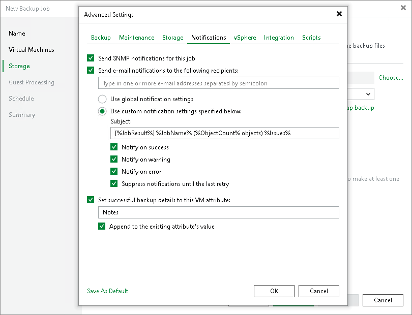

# Configuring Job Notification Settings

Veeam Backup & Replication allows you to configure email notification settings at the job level. You can use the global notification settings that are configured on the backup server or you can specify custom notification settings that apply only to the job. Notifications for a specific job are sent to the recipients you specify in the job settings.

Considerations

Consider the following:

* Reports are sent only after you enable and configure the global email notification settings, as described in section [Configuring Global Email Notification Settings](general_email_notifications.md).
* Reports are sent daily at the time specified in the global notification settings.
* Reports are sent for all notification types selected in the global notification settings, such as Success, Warning and Failure.

Configuring Job Notification Settings

To configure job notification settings:

1. Open advanced settings of the job.

You can find the notification settings description in the dedicated jobs, for example:

* [Notification Settings](backup_job_advanced_notify_vm.md) for backup job
* [Notification Settings](backup_copy_settings_notification.md) for backup copy job
* [Notification Settings](os_backup_job_advanced_notification.md) for object storage backup job
* [Notification Settings](file_share_backup_job_advanced_notifications.md) for file backup job
* [Notification Settings](bc_hpe_storeonce_notification_settings.md) for backup copy jobs for HPE StoreOnce repositories
* [Notification Settings](replica_advanced_notify_vm.md) for replication jobs
* [Notification Settings](agent_job_advanced_notify.md) for Veeam agent backup jobs (for Windows machines)
* [Notification Settings](agent_advanced_notifiy_linux.md) for Veeam agent backup jobs (for Linux machines)

1. On the Notifications tab, select the Send email notifications to the following recipients check box.
2. In the field under the Send e-mail notifications to the following recipients check box, enter an email address to which a notification must be sent. You can enter several email addresses separated with a semicolon.

|  |
| --- |
| Important |
| If you specify the same email recipient in both job notification and global notification settings, Veeam Backup & Replication will send the job notification only. |

1. You can choose to use global notification settings for the job or specify custom notification settings.

* To receive a typical notification for the job, select Use global notification settings. In this case, Veeam Backup & Replication will apply to the job global email notification settings specified for the backup server. For more information, see [Configuring Global Email Notification Settings](general_email_notifications.md).
* To configure a custom notification for the job, select Use custom notification settings and specify notification settings as required.

1. If you want to save this set of settings as the default one, click Save as default. When you create a new job, the saved settings will be offered as the default. This also applies to all users added to the backup server.

