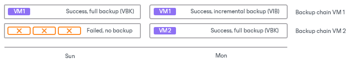
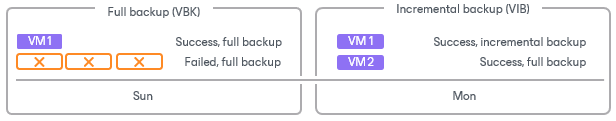

# Job Retry

You can instruct Veeam Backup & Replication to retry a job several times if the initial job run fails. By default, Veeam Backup & Replication automatically retries a failed job 3 times within one job session. You can specify a custom number of retries in the job settings.

Veeam Backup & Replication launches a retry for a job only if the previous job session failed and one or several tasks in the job were not processed. Veeam Backup & Replication does not perform the retry if a job session has finished with the Success or Warning status. During the job retry, Veeam Backup & Replication processes only failed tasks. If you change the job settings after it fails, consider starting the job manually.

The way Veeam Backup & Replication performs the retry differs depending on the [backup chain format](per_vm_backup_files_hv.md) of the backup chain.

|  |
| --- |
| Important |
| Veeam Backup & Replication does not perform automatic retry for jobs that were started or stopped manually. |

Job Retry for Per-Machine Backups

During one job session, Veeam Backup & Replication creates multiple backup files: one backup file for each VM in the job. If some VMs are not processed during a job run, Veeam Backup & Replication creates backup files only for those VMs that are successfully processed.

During a job retry, Veeam Backup & Replication attempts to process failed VMs. If the processing of failed VMs succeeds, Veeam Backup & Replication creates new backup files and writes data of the processed VMs to these files. If processing fails during all job retries, Veeam Backup & Replication processes the failed VMs during the next job sessions and writes VM data to the backup files created by the current job session.

For example, you have configured a job for 2 VMs: VM 1 and VM 2. The job uses the forward incremental method.

During the first job session, Veeam Backup & Replication successfully processes VM 1 and creates a full backup file for it. VM 2 is not processed during all 3 job retries. On the next job session, Veeam Backup & Replication attempts to process the VMs. If processing succeeds, Veeam Backup & Replication creates an incremental backup for VM 1 and a full backup for VM 2. As a result, you have 3 backups:

* Full and incremental backups containing VM 1 data.
* Full backup containing VM 2 data.

Job Retry for Single-File Backups

During one job session, Veeam Backup & Replication creates one backup file for all VMs in the job. If some VMs are not processed during the first job run, Veeam Backup & Replication creates a backup file containing data for those VMs that are successfully processed.

During a job retry, Veeam Backup & Replication attempts to process failed VMs. If processing of failed VMs succeeds, Veeam Backup & Replication writes data of the processed VMs to the backup file that is created at the initial job run. If the processing fails during all job retries, Veeam Backup & Replication processes the failed VMs during the next job sessions and writes VM data to the backup file created by the current job session.

For example, you have configured a job for 2 VMs: VM 1 and VM 2. The job uses the forward incremental method.

During the first job session, Veeam Backup & Replication successfully processes VM 1 and creates a full backup file for it. VM 2 is not processed during all 3 job retries. In this case, Veeam Backup & Replication attempts to process the failed VM 2 within the next job session. Data for VM 2 is written to the backup file created within this job session, which is an incremental backup. As a result, you have 2 files:

* Full backup file containing a full restore point for VM 1.
* Incremental backup file containing a full restore point for VM 2 and an incremental restore point for VM 1.

