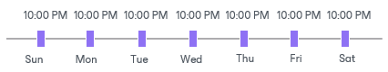
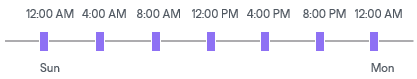
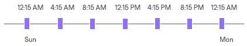
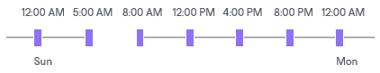
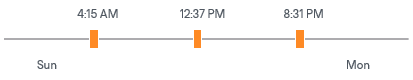

# Automatic Startup Schedule

In this article

To run a job periodically without user intervention, you can schedule the job to start automatically. The Veeam Backup Service running on the backup server continuously checks the configuration settings of all jobs configured on the backup server and starts them according to their schedule.

Veeam Backup & Replication lets you configure the following scheduling settings for jobs:

* [You can schedule jobs to run at specific time every day or on selected days](#time)
* [You can schedule jobs to run periodically at specific time intervals](#interval)
* [You can schedule jobs to run continuously](#cont)
* [You can chain jobs](#chain)

Jobs Started at Specific Time

You can schedule jobs to start at a specific time daily, on specific week days, or monthly on selected days.

This type of schedule requires you to define the exact time when the job must be started. For example, you can configure the job to start daily at 10:00 PM or every first Sunday of the month at 12:00 AM.

Jobs Started at Specific Time Intervals

You can schedule jobs to start periodically throughout the day at a specific time interval. The time interval between job sessions can be defined in minutes or hours. For example, you can configure a job to start every 30 minutes or every 2 hours.

For periodically run jobs, the reference time is midnight (12:00 AM). Veeam Backup & Replication always starts counting defined intervals from 12:00 AM, and the first job session will start at 12:00 AM. For example, if you configure a job to run with a 4-hour interval, the job will start at 12:00 AM, 4:00 AM, 8:00 AM, 12:00 PM, 4:00 PM, and so on.

If necessary, you can specify an offset for periodically run jobs. The offset is an exact time within an hour when the job must start. For example, you can configure the job to start with a 4-hour interval and specify an offset equal to 15 minutes. In this case, the job will start at 12:15 AM, 4:15 AM, 8:15 AM, 12:15 PM, 4:15 PM, and so on.

If a session of a periodically run job does not fit into the specified time interval and overlaps the next planned job session, Veeam Backup & Replication starts the next backup job session at the nearest scheduled interval. For example, you set up a job to run with a 4-hour interval. The first job session starts at 12:00 AM, takes 5 hours and is completed at 5:00 AM. In this case, Veeam Backup & Replication will start a new job session at 8:00 AM.

Jobs Run Continuously

You can schedule the job to run continuously — that is, in a non-stop manner. A new session of a continuously running job starts as soon as the previous job session is completed. Continuously run jobs can help you implement near-continuous data protection (near-CDP) for the most critical applications installed on VMs.

Chained Jobs

In the common practice, data protection jobs configured in the virtual environment start one after another: when job A finishes, job B starts, and so on. You can create a chain of jobs using scheduling settings. To do this, you must define the start time for the first job in the chain. For other jobs in the chain, you must select the After this job option and choose the preceding job from the list.

Job chaining is not limited to jobs of a specific type only. You can create a chain of jobs of different types. For example, you can:

1. Set a backup job as the first job in the chain.
2. Configure a SureBackup job and chain with the backup job. In this case, Veeam Backup & Replication will automatically verify a backup file created by the backup job after the backup job is complete.

|  |
| --- |
| Note |
| Consider the following:   * When you start the initial job manually, Veeam Backup & Replication does not start chained jobs in the Disabled state. If at least one job chained directly to the initial job is in the Enabled state, Veeam Backup & Replication offers you to start the chained jobs as well. Click Yes to start the whole job chain or No to start only the first job in the chain. * If you start the initial job manually and chain another job while the initial job is running, the chained job will start when the initial job completes. * If you schedule active or synthetic full backups for the chained job, but the initial job does not run on these days, the active and synthetic full backups will not be created for the chained job. * If a job in the chain fails or is canceled by a user, Veeam Backup & Replication still starts the next chained jobs. Note that if the failed or canceled job was started by a schedule, Veeam Backup & Replication will start the chained job only after all job retries. |

Recommendations on Job Chaining

You should use job chaining wisely. Job chaining removes guesswork from job scheduling but has a number of drawbacks:

* You cannot predict precisely how much time the initial job will require and when jobs chained to it will start. Depending on the situation, the job schedule may shift, and some operations may not even be performed as planned.

For example, you configure 2 jobs:

+ Job 1 is scheduled to start at 10:00 PM daily and typically takes 1 hour.
+ Job 2 is scheduled to start after Job 1 daily. Synthetic full backup is scheduled on Saturday.

Imagine that Job 1 starts on Saturday and runs for 2.5 hours instead of 1 hour. Job 2 will then start after midnight on Sunday, and the synthetic full backup planned on Saturday will not be created.

* Errors in job sessions may cause the job schedule to shift. For example, if the initial job in the chain fails, Veeam Backup & Replication will attempt to retry it, and the schedule for chained jobs will shift.

* Load on backup infrastructure resources may not be balanced. Some slots on backup proxies and backup repositories may be available but will not be used since jobs are queued to run one by one. And if you use a backup repository that supports multiple I/O streams, its resources will not be used efficiently.

Instead of job chaining, you can balance the load on backup infrastructure components. To do this, you must limit the number of concurrent tasks on backup proxies and backup repositories. For more information, see [Limitation of Concurrent Tasks](limiting_tasks.md).

Page updated 2/12/2025

Page content applies to build 13.0.1.1071
