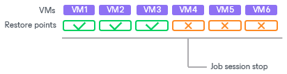
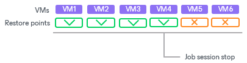

# Manual Stop of Backup Jobs

You can stop job execution at any moment. For example, you can stop a job if the job processes several VMs, but the workload appears to be greater than you expected. Or you can stop the job if there is not enough time to finish the job session.

You can stop a job in 2 ways:

* [You can stop the job immediately](#immediate). In this scenario, Veeam Backup & Replication terminates the job session and does not create a new restore point for VMs that are currently processed.
* [You can stop the job gracefully](#graceful). In this scenario, Veeam Backup & Replication creates a restore point for the VMs that are currently processed and then terminates the job session.

Immediate Stop of Jobs

Immediate job stop terminates the job session instantly. The job finishes with the following results:

* VMs that Veeam Backup & Replication has succeeded in processing by the time you stop the job will have new restore points.
* VMs that Veeam Backup & Replication is currently processing and VMs that Veeam Backup & Replication has not started to process will not have new restore points.

When you stop a job session immediately, Veeam Backup & Replication performs the following operations:

1. If a checkpoint for a VM has already been created, Veeam Backup & Replication instructs Microsoft Hyper-V to remove the checkpoint.
2. Veeam Backup & Replication terminates all job processes and tasks. The job is finished with the Failed error.

All restore points created with the previous job sessions remain untouched. You can use them for restore operations.

Graceful Stop of Jobs

Graceful job stop instructs Veeam Backup & Replication that it must create restore points for VMs that are currently being processed, and then terminate the job. The job finishes with the following results:

* VMs that Veeam Backup & Replication has succeeded to process and VMs that are being processed will have new restore points.
* VMs that Veeam Backup & Replication has not started to process will not have new restore points.

You can use graceful job stop for the following types of jobs:

* Unstructured Data Backup jobs
* VM Backup jobs
* Replication jobs

You cannot use graceful job stop for the following types of jobs:

* File Copy jobs
* Backup Copy jobs
* Restore operations

VMs added to the job are processed in the order defined in job settings. Information about VMs that have already been processed and VMs that are being processed is displayed in job details.

If you stop the job gracefully before Veeam Backup & Replication starts processing the first VM in the job, the job will be finished with the Failed error. You will see the message Operation was canceled by user in the job details.

Related Tasks

[Starting and Stopping Jobs](jobs_start_stop_hv.md)

