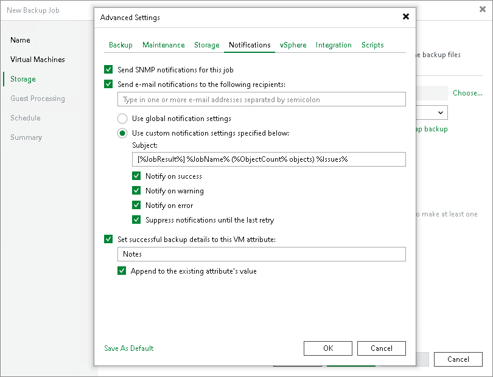

# Configuring SNMP Settings for Jobs

In this article

To receive SNMP traps with results of a specific job:

1. Open advanced settings of the job.
2. On the Notifications tab, select the Send SNMP notifications for this job check box.
3. If you want to save this set of settings as the default one, click Save as default. When you create a new job, the saved settings will be offered as the default. This also applies to all users added to the backup server.

Page updated 3/20/2025

Page content applies to build 13.0.1.1071
