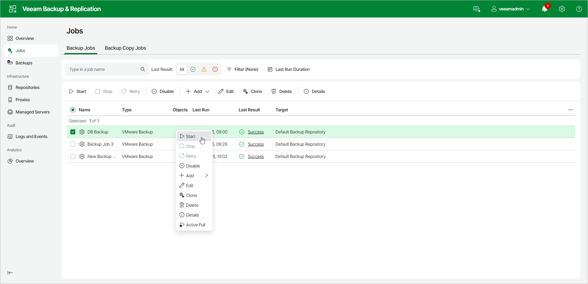
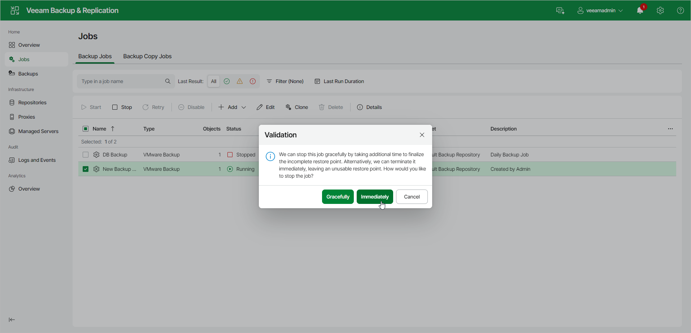

# Starting and Stopping Jobs

You can start a job manually if, for example, you want to create an additional restore point for a VM backup or replica without changing the job schedule. You can also stop a job if, for example, VM processing is about to take a long time, and you do not want the job to produce workload on the production environment during business hours.

Starting Jobs

To start a job:

1. In the management pane, click the Jobs node.
2. In the working area, select a backup job and click Start on the ribbon or right-click the job and select Start.

Stopping Jobs

You can stop a job in one of the following ways:

* Stop the job immediately. In this case, Veeam Backup & Replication will produce a new restore point only for those VMs that have already been processed when you stop the job.
* Stop the job after the current VM. In this case, Veeam Backup & Replication will produce a new restore point only for those VMs that have already been processed and for VMs that are being processed at the moment.

To stop a job:

1. In the management pane, click the Jobs node.
2. In the working area, select a backup job and click Stop on the ribbon or right-click the job and select Stop. In the displayed window, click Immediately.

To stop the job after the current VM:

1. In the management pane, click the Jobs node.
2. In the working area, right-click a job and select Stop. In the displayed window, click Gracefully.

Related Topics

* [Manual Start of Backup Jobs](scheduling_manual.md)
* [Manual Stop of Backup Jobs](job_sessions_termination.md)

