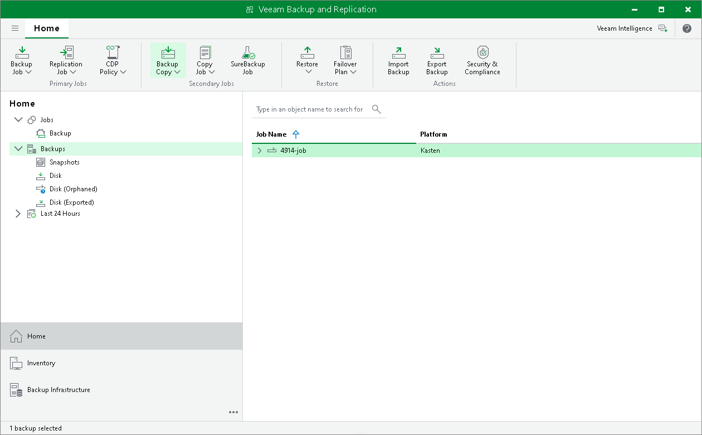

In this article

Backup copy is a technology that helps you create and store backup data in different locations. Storing data in different locations increases its availability and ensures that data can be recovered in case a disaster strikes.

The backup copy is a job-driven process. Veeam Backup & Replication fully automates the backup copy process and lets you specify retention settings to maintain the desired number of restore points, as well as full backups for archival purposes. To create a backup copy job, Veeam Backup & Replication uses the Veeam Kasten policy as a source and copies backed-up data created by this policy. For more information on the backup copy functionality, see the [Backup Copy](https://helpcenter.veeam.com/docs/backup/vsphere/backup_copy.html?ver=120) section in the Veeam Backup & Replication User Guide.

|  |
| --- |
| Important |
| As a source, you can use only Veeam Kasten policies that export backups to Veeam backup repositories. |

To create a backup copy job, do the following:

1. Check [limitations and prerequisites](https://helpcenter.veeam.com/docs/backup/vsphere/backup_copy_before_you_begin.html?ver=120) listed in the Veeam Backup & Replication User Guide.
2. Open the Home view, navigate to Backups and select the necessary Veeam Kasten policy.
3. Complete the New Backup Copy Job wizard as described in the [Creating Backup Copy Jobs for VMs and Physical Machines](https://helpcenter.veeam.com/docs/backup/vsphere/backup_copy_create.html?ver=120) section in the Veeam Backup & Replication User Guide.

Page updated 6/3/2025

Page content applies to build 13.0.1.1071
