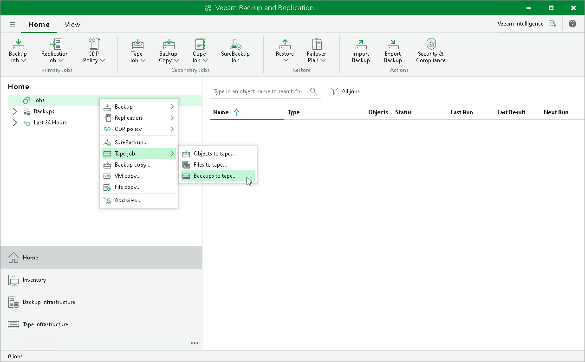

In this article

Storing data on tape devices helps you improve the level of safety and implement the 3-2-1 rule (3 copies, 2 types of media, 1 offsite location). To administer all operations on tapes in your Veeam Backup & Replication console, Veeam Backup & Replication allows you to automate the copying of image-level backups to tape devices. It lets you specify scheduling, archiving and media automation options. For more information on the supported tapes and operations you can perform with tapes, see the [Tape Devices Support](https://helpcenter.veeam.com/docs/backup/vsphere/tape_device_support.html?ver=120) section in the Veeam Backup & Replication User Guide.

To copy backups exported by Veeam Kasten policies to tapes, do the following:

1. Configure the tape infrastructure:

1. Connect tape devices as described in the [Tape Devices Deployment](https://helpcenter.veeam.com/docs/backup/vsphere/tape_deployment.html?ver=120) section in the Veeam Backup & Replication User Guide.
2. Perform the initial configuration as described in steps 1–3 of the [Getting Started with Tapes](https://helpcenter.veeam.com/docs/backup/vsphere/getting_started_with_tapes.html?ver=120) section in the Veeam Backup & Replication User Guide.

1. Create a backup to tape job as described in the [Creating Backup to Tape Jobs](https://helpcenter.veeam.com/docs/backup/vsphere/creating_backup_to_tape_jobs.html?ver=120) section in the Veeam Backup & Replication User Guide.

Page updated 6/3/2025

Page content applies to build 13.0.1.1071
