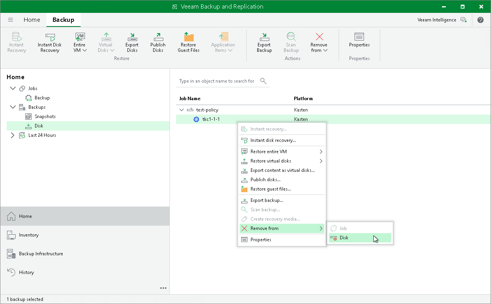

In this article

Veeam Plug-In for Kasten allows you to permanently delete backups exported by Veeam Kasten policies.

If you want to remove records about backups from both Veeam Backup & Replication infrastructure and configuration database, you can use Delete from disk operation. When you delete backup files from a disk, Veeam Backup & Replication deletes the whole chain from the Veeam backup repository. Thus, on the next run of the Veeam Kasten policy, Veeam Plug-In for Kasten will create full backups for applications included and added to the job.

|  |
| --- |
| Important |
| Do not delete backup files from the Veeam backup repository manually. If you delete backup files manually, subsequent backup or replication job sessions will fail. |

This option allows you to delete the following type of data:

* Backup files from the Veeam backup repository
* Specific applications from backups

To delete backup files or applications from the Veeam backup repository, do the following:

1. In the Veeam Backup & Replication console, open the Home view.
2. In the inventory pane, select Backups > Disk.
3. In the working area, do one of the following:

* [To delete a backup] In the working area, select the backup and click Remove from > Disk on the ribbon. You can also right-click the backup and select Remove from > Disk.
* [To delete an application from a backup] In the working area, expand the necessary backup, select the application you want to delete and click Remove from > Disk on the ribbon. You can also right-click the backup and select Remove from > Disk.

Page updated 8/7/2025

Page content applies to build 13.0.1.1071
