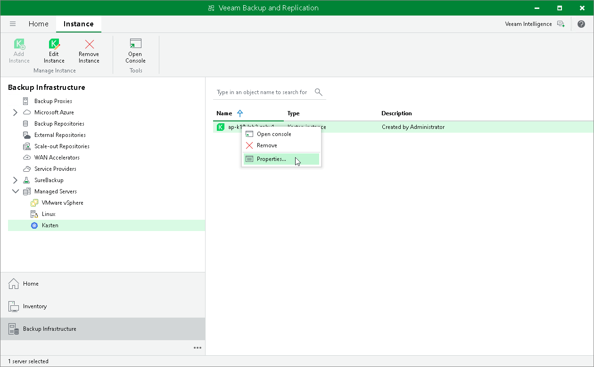

# Editing Instance Settings

To edit the settings of a Kasten instance, do the following:

1. Open the Backup Infrastructure view.
2. In the inventory pane, select Managed Servers.
3. In the working area, select the Kasten instance and click Edit Instance on the ribbon. Alternatively, right-click the appliance and select Properties.
4. Complete the wizard as described in the [Adding Kasten Instance](adding_k10.md) section.

