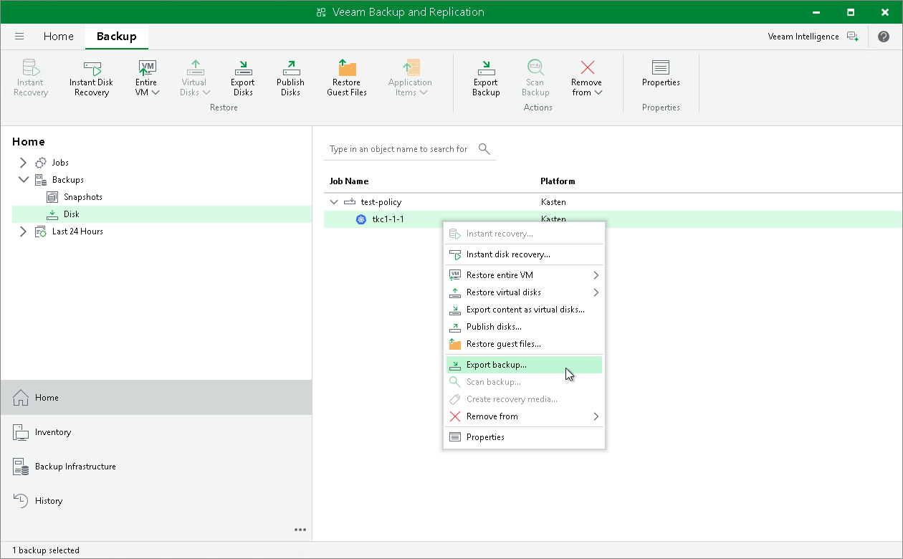

In this article

You can export full backup files of applications backed up by Veeam Kasten policies. Exporting full backup files allows you to produce a full backup file (VBK) that acts as an independent restore point. By default, this backup file is stored in a separate folder in a Veeam backup repository used by the Veeam Kasten policy. You can move this backup file to a different location without affecting a backup chain of backup files exported by the Veeam Kasten policy. For more information on exporting full backups, see the [Exporting Backups](https://helpcenter.veeam.com/docs/backup/vsphere/exporting_backups.html?ver=120) section in the Veeam Backup & Replication User Guide.

To export full backup files of applications backed up by Veeam Kasten:

1. Launch the Export Backup wizard. To do that, open the Home view. In the inventory pane, navigate to Backups > Disk. In the working area, select applications whose restore points you want to export. On the ribbon, click Export Backup. Alternatively, right-click the application and select Export backup.
2. Complete the wizard as described in the [Performing Export](https://helpcenter.veeam.com/docs/backup/vsphere/performing_full_export.html?ver=120) section in the Veeam Backup & Replication User Guide.

After backup files are exported, they are displayed under the Backups > Disk (Exported) node.

Page updated 6/3/2025

Page content applies to build 13.0.1.1071
