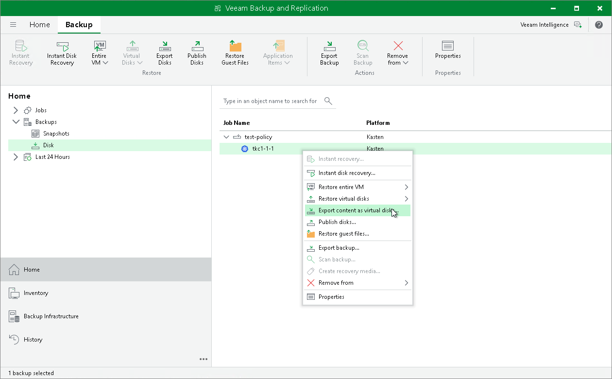

In this article

Veeam Backup & Replication allows you to restore disks of backups exported from Veeam Kasten. You can restore disks in the VMDK, VHD or VHDX format. For more information on disk export, see the [Disk Export](https://helpcenter.veeam.com/docs/backup/vsphere/disk_export.html?ver=120) section in the Veeam Backup & Replication User Guide.

To restore disks of backups exported from Veeam Kasten and convert them to the VMDK, VHD or VHDX format:

1. Launch the Export Disk wizard. To do that, open the Home view. In the inventory pane, navigate to Backups > Disk. In the working area, select applications whose disk you want to export. On the ribbon, click Export Disks. Alternatively, right-click the application and select Export content as virtual disks.
2. Complete the wizard as described in the [Exporting Disks](https://helpcenter.veeam.com/docs/backup/vsphere/exporting_disks.html?ver=120) section in the Veeam Backup & Replication User Guide.

Page updated 6/3/2025

Page content applies to build 13.0.1.1071
