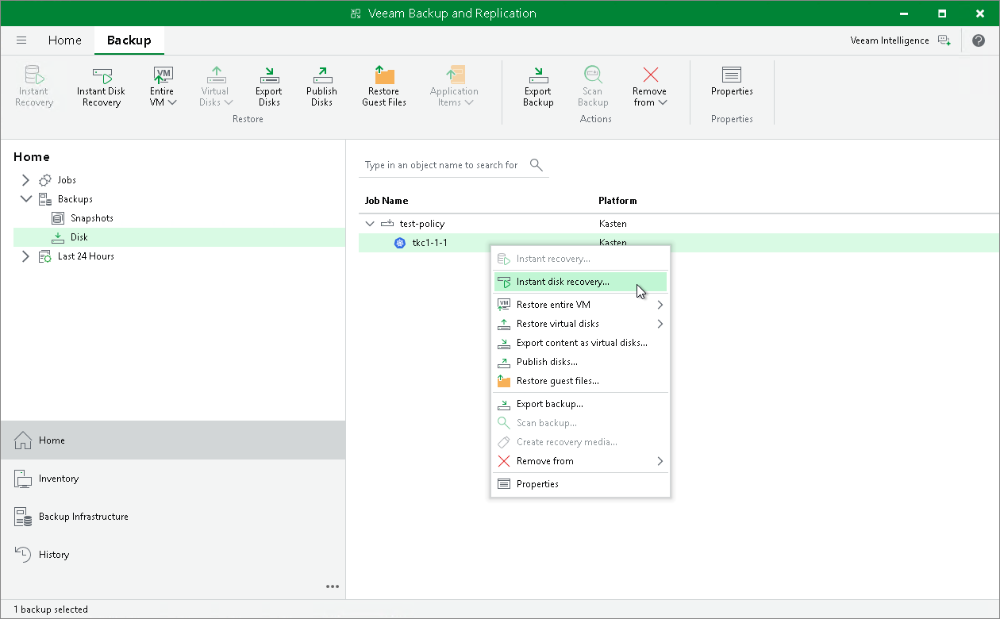

In this article

With Instant First Class Disk (FCD) Recovery, you can immediately restore disks of backups exported from Veeam Kasten and register them as FCDs in a VMware cluster. Instant FCD Recovery allows you to instantly restore FCDs without attaching them to the production environment. For more information on First Class Disk (FCD) Recovery, see the [Instant First Class Disk (FCD) Recovery](https://helpcenter.veeam.com/docs/backup/vsphere/instant_disk_recovery_fcd.html?ver=120) section in the Veeam Backup & Replication User Guide.

To perform FCD recovery of backups exported from Veeam Kasten:

1. Check [limitations and prerequisites](https://helpcenter.veeam.com/docs/backup/vsphere/byb_fcd.html?ver=120) listed in the Veeam Backup & Replication User Guide.
2. Launch the Instant Disk Recovery wizard. To do that, open the Home view. In the inventory pane, navigate to Backups > Disk. In the working area, select an application whose disk you want to export. On the ribbon, click Instant Disk Recovery. Alternatively, right-click the application and select Instant disk recovery.
3. Complete the wizard as described in the [Instant FCD Recovery](https://helpcenter.veeam.com/docs/backup/vsphere/instant_fcd_recovery_vm.html?ver=120) section in the Veeam Backup & Replication User Guide.

Page updated 8/26/2024

Page content applies to build 13.0.1.1071
