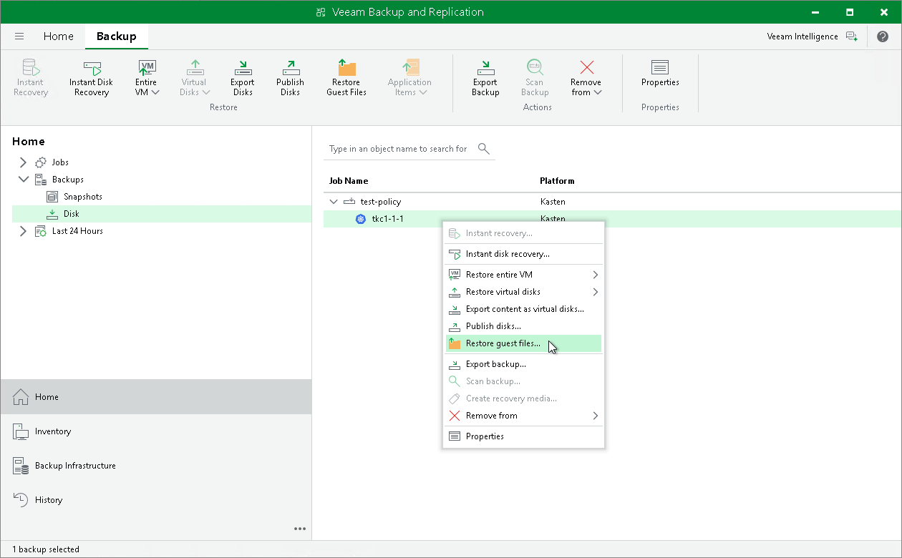

# Restoring Guest OS Files

You can restore individual guest OS files and folders from backups exported from Veeam Kasten. You can restore files and folders directly from image-level backups. For more information, see the [Guest OS File Recovery](https://helpcenter.veeam.com/docs/backup/vsphere/guest_file_recovery.html?ver=120) section in the Veeam Backup & Replication User Guide.

|  |
| --- |
| Note |
| Consider the following:   * Veeam Plug-In for Kasten supports only restore from Linux, Unix and other non-Microsoft Windows OSes. * Veeam Plug-In for Kasten does not support restore of individual guest OS files and folders to the original location (applications added to a Veeam Kasten cluster). You can only save files and folders to a new location. For more information, see the [Saving Files to New Location](https://helpcenter.veeam.com/docs/backup/vsphere/multios_restore_save_vm.html?ver=120#restoring-files-and-folders-to-new-location) section in the Veeam Backup & Replication User Guide. |

To restore guest OS files from Linux, Unix and other file systems, do the following:

1. Check [considerations and limitations](https://helpcenter.veeam.com/docs/backup/vsphere/multios_restore_before_you_begin.html?ver=120) listed in the Veeam Backup & Replication User Guide.
2. Launch and complete the File Level Restore wizard. To do that, open the Home view and navigate to Backups > Disk. In the working area, select an application whose files you want to restore. On the ribbon, click Restore Guest Files. Alternatively, right-click the application and select Restore guest files.
3. Complete the wizard as described in the [Restoring VM Guest OS Files (Multi-OS)](https://helpcenter.veeam.com/docs/backup/vsphere/multios_restore_intro.html?ver=120) section in the Veeam Backup & Replication User Guide.

