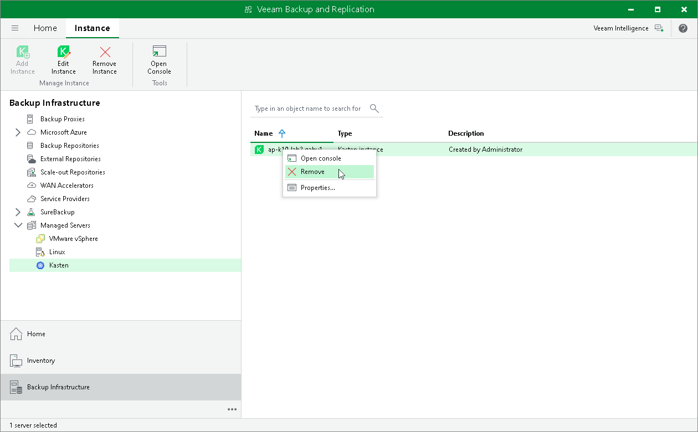

# Removing Instance

If you do not plan to manage a Kasten instance from the Veeam Backup & Replication console, you can remove it from the Veeam Backup & Replication infrastructure.

|  |
| --- |
| Note |
| After you remove the Kasten instance, the changes will take place on the Veeam Backup & Replication side and it will result in the following limitations:   * Veeam Kasten policies belonging to the instance will not be available in the Veeam Backup & Replication console. * All restore points are no longer available in the Snapshot node. * You will not be able to restore to Kubernetes from Kasten exports located in a Veeam backup repository. Veeam Backup & Replication will move them to the Disk (orphaned) node. |

Removing Instance

To remove an instance, do the following:

1. Open the Backup Infrastructure view.
2. In the inventory pane, select Managed Servers.
3. In the working area, select the appliance that you want to remove and click Remove Instance on the ribbon. Alternatively, right-click the instance and select Remove.
4. In the Veeam Backup & Replication window, click Yes.

