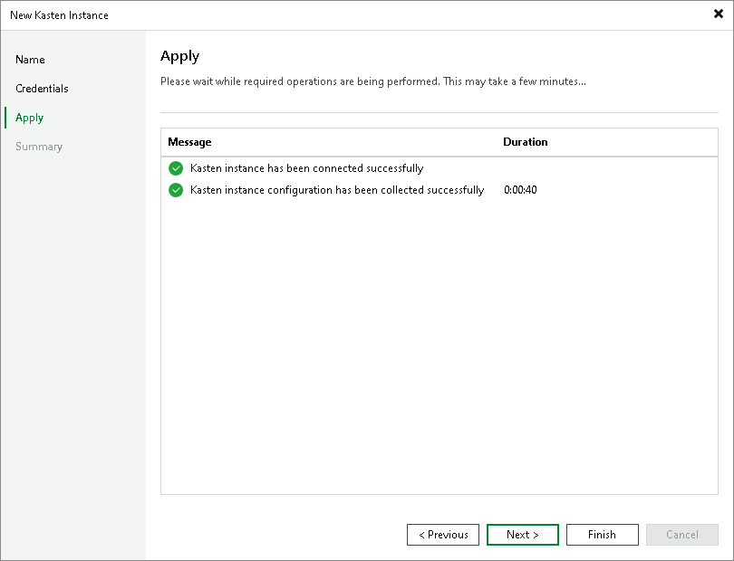

In this article

At the Apply step of the wizard, wait until Veeam Backup & Replication applies the settings. Click Next to complete the procedure of adding the Kasten application.

Page updated 8/26/2024

Page content applies to build 13.0.1.1071
