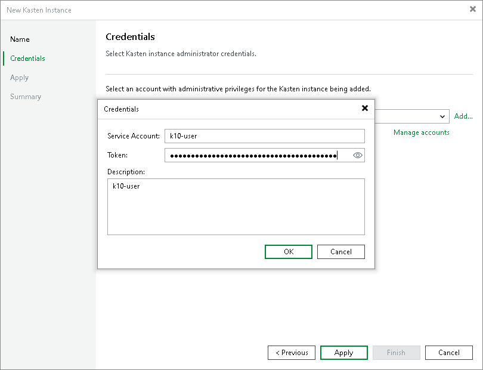

# Step 3. Specify Credentials

At the Credentials step of the wizard, specify credentials for the Kasten application. If you have not added credentials beforehand, click Manage accounts or Add to add the necessary credentials and specify the following settings:

1. In the Service Account field, specify any symbols that you want to use for a service account.
2. In the Token field, specify the bearer token of a cluster service account that has the k10-admin ClusterRole. For more information on how to get the bearer token, see section [Obtaining Tokens](https://docs.kasten.io/latest/access/authentication.html#obtaining-tokens) in Veeam Kasten Docs. For more information on K10 cluster roles, see section [Default Veeam Kasten ClusterRoles](https://docs.kasten.io/latest/access/rbac.html#default-veeam-kasten-clusterroles) in Veeam Kasten Docs.

|  |
| --- |
| Note |
| When you add the Veeam Kasten application, Veeam Backup & Replication checks the certificate that is used to access the Kasten dashboard. If the certificate is not trusted, Veeam Backup & Replication will display a certificate warning.  In the warning window, you can do the following:   * Click View for the detailed information about the certificate. * Click Continue to trust the certificate. * Click Cancel if you do not trust the certificate. However, in this case, you will not be able to connect to the Kasten instance.   To avoid this warning, you must add the certificate to a list of trusted certificates on a Microsoft Windows machine where Veeam Backup & Replication is installed. |

