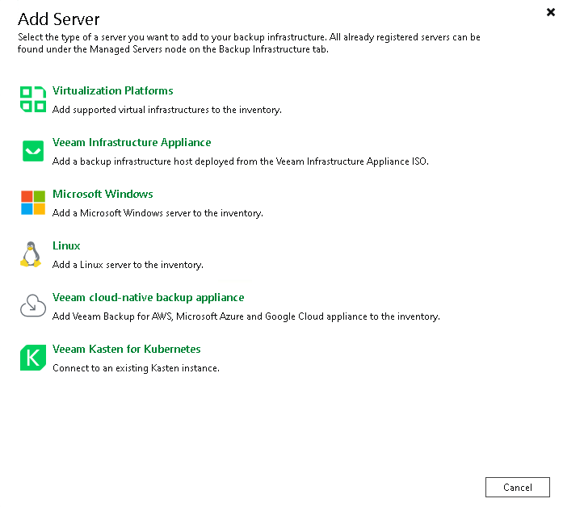

In this article

To launch the New Kasten Instance wizard, do one of the following:

* Open the Backup Infrastructure view. Navigate to Managed Servers and click Add Server on the ribbon. In the Add Server window, select Veeam Kasten for Kubernetes.

* Open the Backup Infrastructure view. In the inventory pane, right-click the Managed Servers node and select Add Server. In the Add Server window, select Veeam Kasten for Kubernetes.

Page updated 10/27/2025

Page content applies to build 13.0.1.1071
