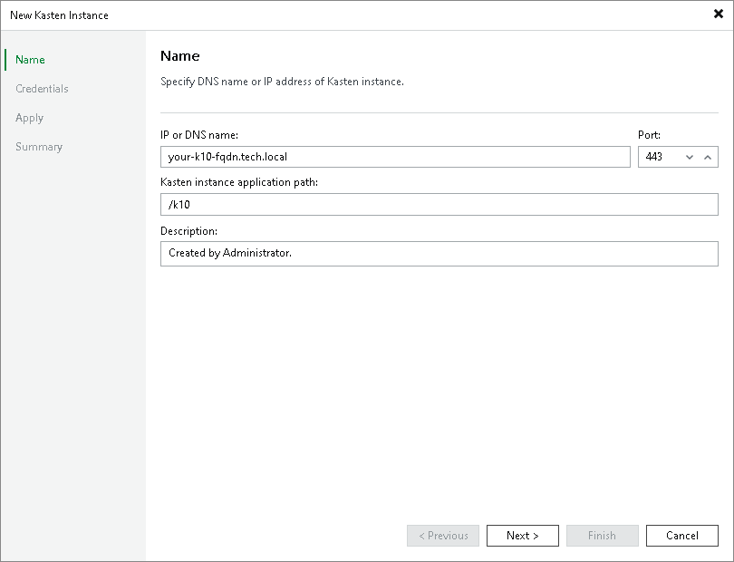

In this article

At the Name step of the New Kasten Instance wizard, specify an IP address or DNS name, a URL path and a description of the Veeam Kasten application.

1. In the IP or DNS name field, enter an IP address or DNS name. To specify the DNS name, use the following format: your-k10-fqdn.tech.local.
2. In the Kasten instance application path, provide a URL path to the Veeam Kasten dashboard.
3. In the Description field, provide a description of the Veeam Kasten application for future reference. The default description contains information about the user who created the Kasten instance, date and time when the instance was created.

Page updated 8/6/2025

Page content applies to build 13.0.1.1071
