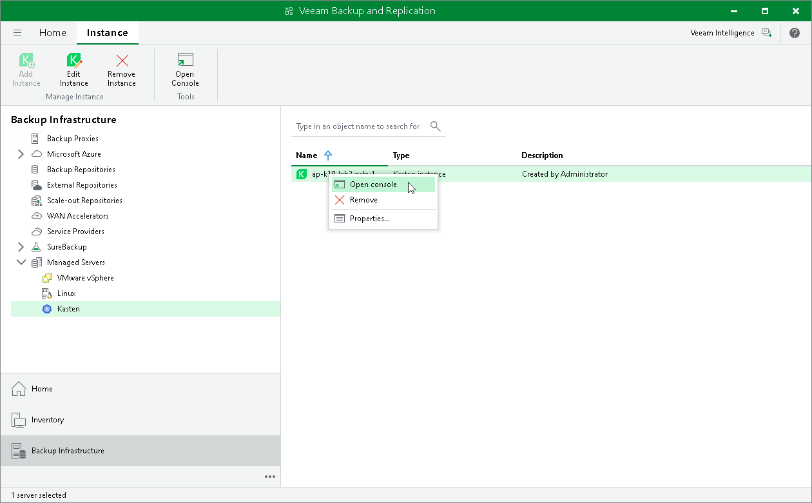

# Opening Instance Web UI

If you want to access Veeam Kasten and configure options not available in the Veeam Backup & Replication console, you can perform the necessary actions using the Veeam Kasten Web UI.

To open the Veeam Kasten Web UI, do the following:

1. Open the Backup Infrastructure view.
2. In the inventory pane, select Managed Servers.
3. In the working area, select the Kasten instance and click Open Console on the ribbon. Alternatively, right-click the instance and select Open console.

Veeam Backup & Replication will open a web browser and navigate you to the Veeam Kasten URL. For more information on what you can do in the Web UI, see the [Veeam Kasten Docs](https://docs.kasten.io/latest/index.html).

