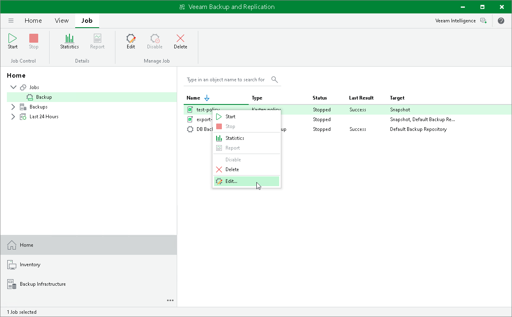

In this article

Veeam Plug-In for Kasten allows you to edit the settings of Veeam Kasten policies from the Veeam Backup & Replication console using redirection to the Veeam Kasten web UI. For example, you can add more applications to the Veeam Kasten policy or change the Veeam Kasten policy description.

To edit a backup policy:

1. Open the Home view.
2. In the inventory pane, select Jobs.
3. In the working area, select the necessary backup policy and click Edit on the ribbon. Alternatively, right-click the policy and select Edit. The Edit Policy wizard will open in your browser.

Page updated 6/3/2025

Page content applies to build 13.0.1.1071
