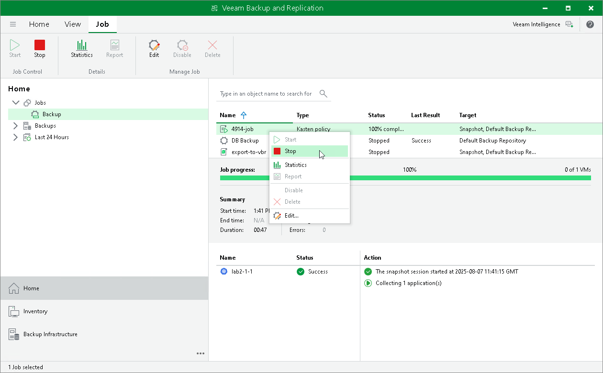

In this article

Veeam Plug-In for Kasten allows you to start a Veeam Kasten policy manually from the Veeam Backup & Replication console. It can be helpful if you want to create an additional snapshot or export without modifying the configured backup policy schedule. Additionally, you can stop a Veeam Kasten backup policy if the processing of applications is about to take too long and you do not want the policy to produce a heavy load on the production environment during business hours.

Starting Kasten Policies

To start a Kasten policy:

1. Open the Home view.
2. In the inventory pane, select Jobs.
3. In the working area, select the necessary Veeam Kasten policy and click Start on the ribbon. Alternatively, right-click the selected policy and click Start.

|  |
| --- |
| Tip |
| To select several Kasten policies, click the first policy, press and hold the [SHIFT] key and select the other policies. |

Stopping Kasten Policies

To stop a Veeam Kasten policy:

1. Open the Home view.
2. In the inventory pane, select Jobs.
3. In the working area, select the necessary Veeam Kasten policy and click Stop on the ribbon. Alternatively, right-click the selected policy and click Stop. In the displayed window, click Yes.

|  |
| --- |
| Tip |
| To select several Kasten policies, click the first policy, press and hold the [SHIFT] key and select the other policies. |

Page updated 6/3/2025

Page content applies to build 13.0.1.1071
