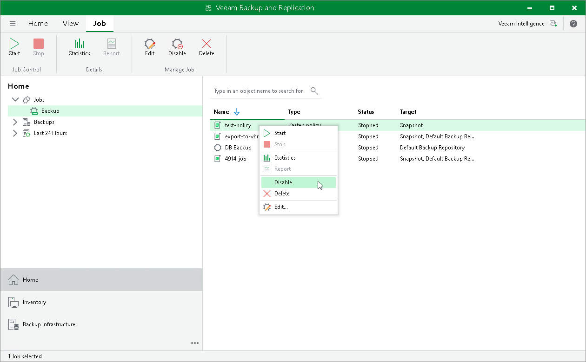
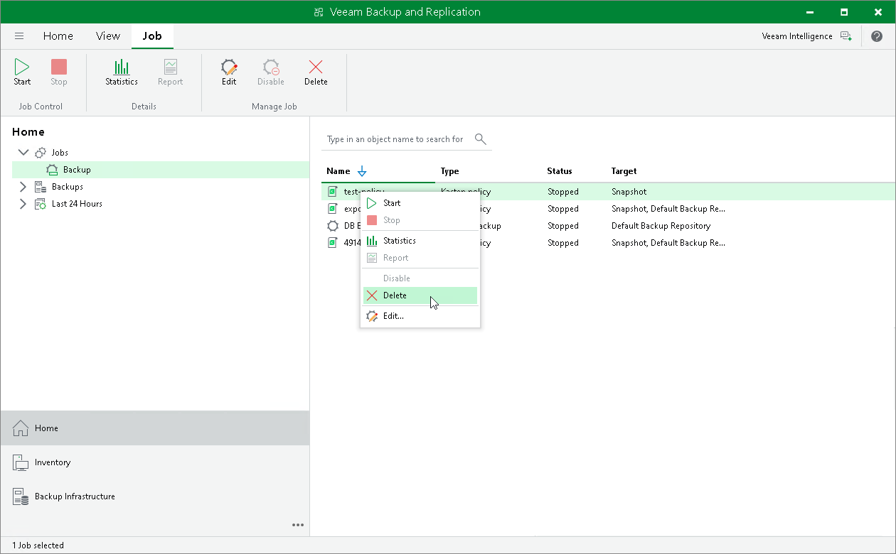

# Disabling and Removing Policies

Veeam Plug-In for Kasten allows you to temporarily disable or permanently delete Veeam Kasten policies from both Veeam Backup & Replication and Veeam Kasten infrastructures. When you disable a backup policy, Veeam Plug-In for Kasten disables the schedule configured for the backup policy. It means that the Veeam Kasten policy will no longer start automatically. You can enable and start the disabled policy manually any time you need.

Disabling Kasten Policies

You can disable a Veeam Kasten policy only if it has a schedule configured beforehand. For more information on configuring a Veeam Kasten policy schedule, see [Veeam Kasten Docs](https://docs.kasten.io/5.5.3/usage/protect.html#scheduling).

To disable a Veeam Kasten policy:

1. Open the Home view.
2. In the inventory pane, select Jobs.
3. In the working area, select the necessary backup policy and click Disable on the ribbon. Alternatively, right-click the necessary backup policy and select Disable.

|  |
| --- |
| Tip |
| Consider the following:   * To select several Kasten policies, click the first policy, press and hold the [SHIFT] key and select the other policies. * To enable a disabled policy, select it and click Disable once again. |

Removing Kasten Policies

To delete a Veeam Kasten policy from the Veeam Backup & Replication infrastructure:

1. Open the Home view.
2. In the inventory pane, select Jobs.
3. In the working area, select the necessary Veeam Kasten policy and click Delete on the ribbon. Alternatively, right-click the necessary backup policy and select Delete.

|  |
| --- |
| Tip |
| To select several Kasten policies, click the first policy, press and hold the [SHIFT] key and select the other policies. |

After the policy is deleted, the backups exported by this policy are displayed under the Backups > Disk (Orphaned) node. If the backups exported by the policy were also stored in the capacity tier, they will also be displayed under the Backups > Capacity Tier (Orphaned) node.

|  |
| --- |
| Important |
| Veeam Plug-In for Kasten deletes a Veeam Kasten policy from both Veeam Backup & Replication infrastructure and the Kasten instance. |

