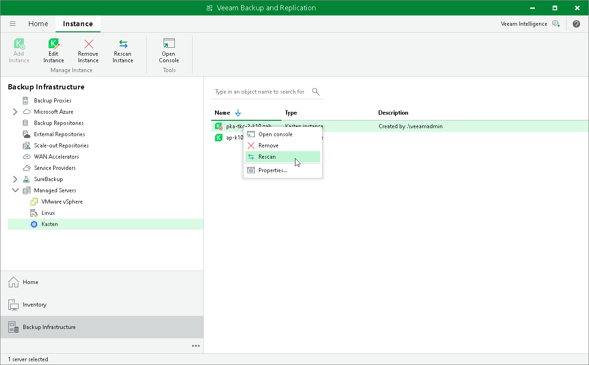

# Rescanning Instance

You can rescan the Kasten instance configured in the backup infrastructure. It may be necessary when the Kasten instance becomes unavailable, or there is a mismatch between data in the backup console and on the actual appliance. Veeam Backup & Replication will erase and re-download Kasten instance settings and some statistics during the rescan operation.

To rescan the Kasten instance, do the following:

1. Open the Backup Infrastructure view.
2. In the inventory pane, select Managed Servers.
3. In the working area, select the Kasten instance and click Rescan Instance on the ribbon. Alternatively, right-click the instance and select Rescan.
4. In the Veeam Backup & Replication window, click Yes.

