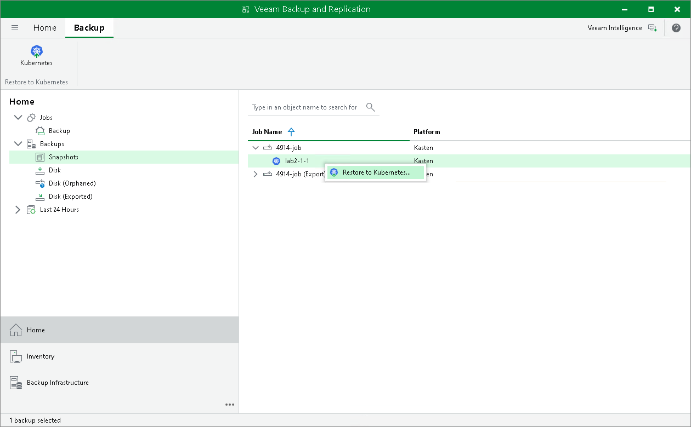

In this article

Veeam Backup & Replication allows you to restore applications to the Kubernetes cluster. When you restore applications, Veeam Backup & Replication redirects you to the Veeam Kasten Web UI to proceed with the restore.

To restore applications, do the following:

1. Open the Home view. In the inventory pane, navigate to Backups > Disk if you want to restore from Kasten exports or to Backups > Snapshots if you want to restore from snapshots. In the working area, select an application whose snapshot you want to restore. On the ribbon, click Kubernetes. Alternatively, right-click the application and select Restore to Kubernetes.
2. Follow the instructions provided in the [Veeam Kasten docs](https://docs.kasten.io/5.5.3/usage/restore.html).

You can view restore sessions under the Home > Last 24 Hours node or under History > Restore node.

Page updated 6/3/2025

Page content applies to build 13.0.1.1071
