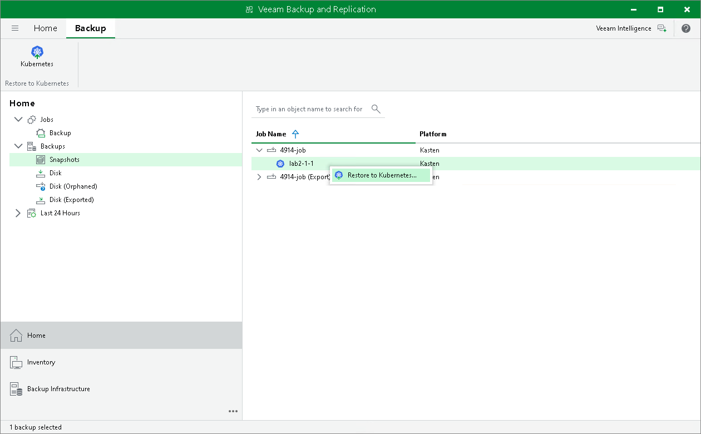

# Restoring to Kubernetes

Veeam Backup & Replication allows you to restore applications to the Kubernetes cluster. When you restore applications, Veeam Backup & Replication redirects you to the Veeam Kasten web UI to proceed with the restore.

To restore applications, do the following:

1. Open the Home view. In the inventory pane, navigate to Backups > Disk to restore from Kasten exports, or to Backups > Snapshots to restore from snapshots.
2. In the working area, select the application that you want to restore. On the ribbon, click Kubernetes. Alternatively, right-click the application and select Restore to Kubernetes.
3. Follow the instructions provided in the [Veeam Kasten Docs](https://docs.kasten.io/latest/usage/restore.html).

You can view restore sessions under the Home > Last 24 Hours node or under History > Restore node.

Page updated 2026-08-04

