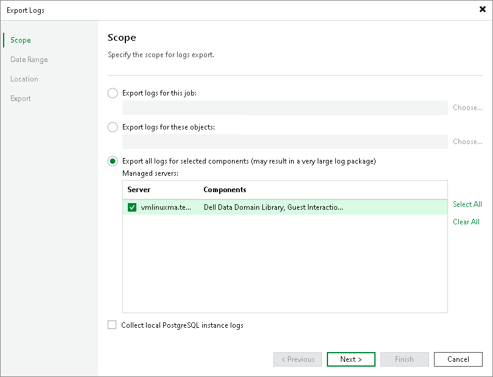

In this article

If you have any questions or issues with Veeam Kasten Plug-in for Veeam Backup & Replication, you can search for a resolution on [Veeam R&D Forums](https://forums.veeam.com/) or submit a support case in the [Veeam Customer Support Portal](https://www.veeam.com/support.html).

|  |
| --- |
| Important |
| Veeam Customer Support does not assist with issues related to the Veeam Kasten platform, management of Kubernetes containers and Veeam Kasten policies. You have to contact [Veeam Kasten support](https://www.kasten.io/contactus/?__hstc=78384331.41d2c651fa13d48193565c2b39c20371.1624009650250.1637848449699.1638351654165.11&__hssc=78384331.1.1638351654165&__hsfp=4211752372&hsutk=41d2c651fa13d48193565c2b39c20371&contentType=standard-page). |

When you submit a support case, we recommend you provide information on the installed products to the Veeam Customer Support Team. Product logs contain this information.

To export logs, do the following:

1. From the main menu of the Veeam Backup & Replication console, select Help > Support Information.
2. At the Scope step of the Export Logs wizard, select Export all logs for selected components.
3. In the Managed servers list, select the Veeam Backup & Replication server and other components for which you want to export logs.
4. Complete the wizard as described in the [Exporting Logs](https://helpcenter.veeam.com/docs/backup/hyperv/exporting_logs.html?ver=120) section in the Veeam Backup & Replication User Guide.

|  |
| --- |
| Important |
| In the Export Logs wizard, you can not export logs for separate Kasten policies and backup files. |

Page updated 6/3/2025

Page content applies to build 13.0.1.1071
