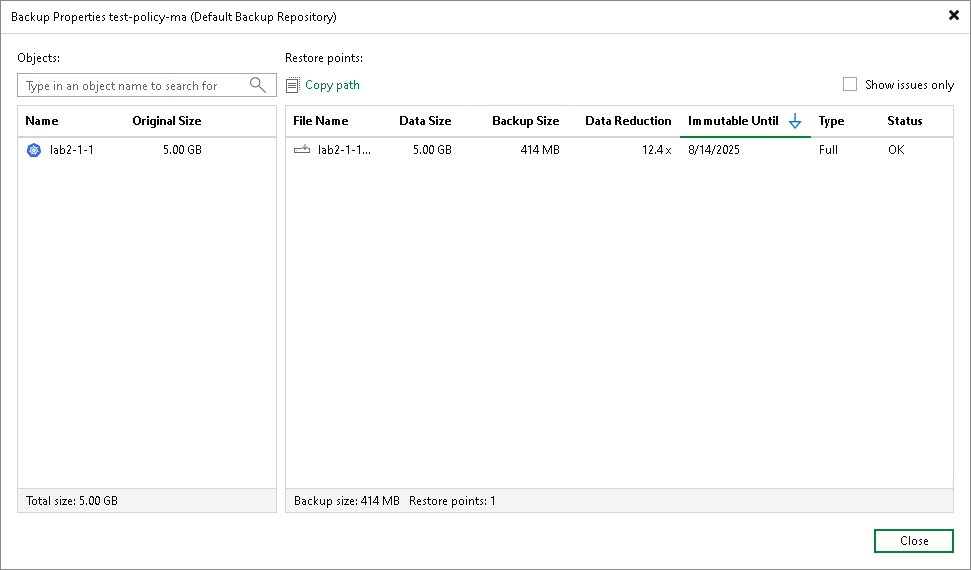

In this article

In the Veeam Backup & Replication console, you can view information about backups exported by Veeam Kasten policies or manually to Veeam backup repositories. This information provides the following data:

* Veeam backup repository and folder on this repository where the backup is stored
* Available restore points
* Date of restore points creation
* Data size and backup file size

In the Backup Properties window, you can see the following icons:

| Icon | State |
| --- | --- |
|  | Full restore point |
|  | Missing full restore point |

To view summary information for backup files:

1. In the Veeam Backup & Replication console, open the Home view.
2. In the inventory pane, select Backups > Disk.
3. In the working area, right-click the backup and select Properties.
4. To see the list of available restore points, select the necessary application from the Objects list.

Page updated 6/3/2025

Page content applies to build 13.0.1.1071
