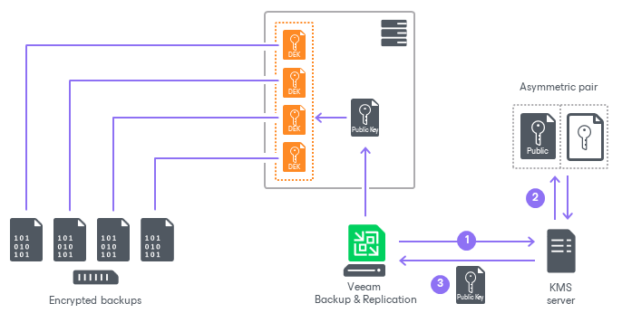

# How KMS Works

In this article

When you add the KMS server in the Veeam Backup & Replication console and start using KMS keys for data encryption, Veeam Backup & Replication asks the KMS server to generate an asymmetric KMS key for the required job or repository. Veeam Backup & Replication stores a public key in the configuration database and uses it for data encryption. The KMS server stores a private key and uses it for data decryption.

Backup files encrypted with the KMS solution are decrypted automatically when you import them. You need to decrypt backup files manually only in the following situations:

* You import backup files to a new Veeam Backup & Replication installation that is not connected to the KMS server yet.
* You use VBK files to import backups. Also, a part of the backup chain is encrypted with the KMS solution, the other part is encrypted with the password-based keys.
* You use tapes and have specific considerations. For more information, see [Decrypting Tapes with KMS Keys](tape_decrypt_kms.md).

|  |
| --- |
| Note |
| In case of a KMS server failure, backup jobs that use the KMS keys for data encryption will fail. To decrypt backup files, you can use Veeam Backup Enterprise Manager if the encryption password loss protection is enabled. For more information, see [Password Loss Protection](encryption_password_loss_protection.md). |

The KMS server rotates KMS keys at a time interval specified in the KMS policies. To get updates from the KMS server, Veeam Backup & Replication runs a system job. During the job session, Veeam Backup & Replication performs the following steps:

1. Sends a request to the KMS server and gets information about recently rotated KMS keys if there are any.
2. Updates public keys in the Veeam Backup & Replication configuration database.

By default, the Veeam Backup & Replication system job runs every 24 hours. If you want to change the default time period, contact Veeam Customer Support.

Page updated 5/21/2025

Page content applies to build 13.0.1.1071
