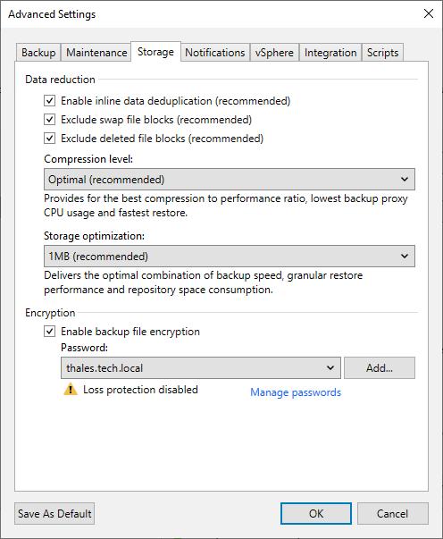
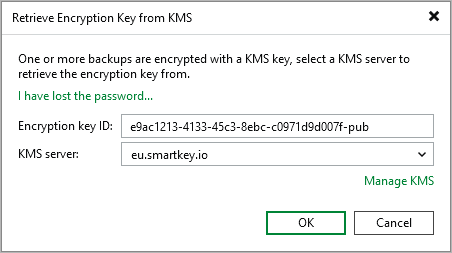

# Using KMS Keys

In this article

To use KMS keys for data encryption, go to the backup job or storage settings and select the KMS server in the Password field. For more information about data encryption levels, see [Job Encryption](encryption_job.md) and [Storage Encryption](encryption_storage.md).

Note that If the KMS server is unavailable, the job session will fail.

Decrypting Backups

If you encrypt data encryption keys with KMS keys, import an encrypted backup file to the Veeam Backup & Replication console. The file will be automatically decrypted and appear under the Backups > Disk (Imported) node in the inventory pane.

If you need to decrypt backup files manually, do the following:

1. In the inventory pane, select the Backups > Disk (Encrypted) node.
2. In the working area, select an encrypted backup file and click Specify Password on the ribbon. Alternatively, you can right-click the backup and select Decrypt backup.
3. Check the encryption key ID and selected KMS server, and click OK.

Consider the following:

* If the KMS key has changed several times or you have changed the encryption method to the password, you need to specify them in the following manner:

+ If you select a metadata file (VBM) for import, you must specify the latest KMS key or password that was used to encrypt data encryption keys.
+ If you select a full backup file (VBK) for import, you must specify the whole set of KMS keys and passwords that were used to encrypt data encryption keys.

* If you cannot use KMS keys due to a KMS server failure, you can issue a request to Veeam Backup Enterprise Manager and restore data from an encrypted file using Enterprise Manager keys. This option works only if the encryption password loss protection is enabled. For more information, see [Password Loss Protection](encryption_password_loss_protection.md).

Related Topics

[Decrypting Tapes with KMS Keys](tape_decrypt_kms.md)

Page updated 7/23/2025

Page content applies to build 13.0.1.1071
