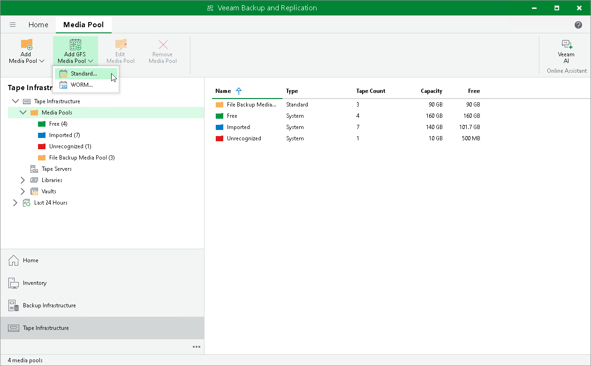

# Step 1. Launch New GFS Media Pool Wizard

To run the New GFS Media Pool wizard:

1. Open the Tape Infrastructure view and click Add GFS Media Pool on the ribbon. Alternatively, you can open the Tape Infrastructure view, right-click the Media Pools node and choose Add GFS Media Pool.
2. Select Standard if you want to create a media pool for standard tapes or WORM if you want to create a media pool for WORM (Write Once Read Many) tapes.

|  |
| --- |
| Tip |
| You can also launch the New GFS Media Pool wizard when configuring backup to tape jobs (that is, directly from the New Backup to Tape Job wizard. For more information, see [Creating Backup to Tape Jobs](creating_backup_to_tape_jobs.md). |

