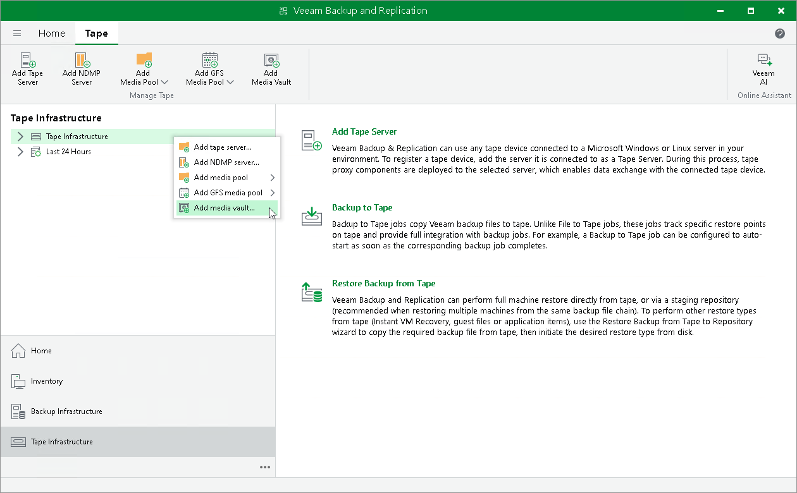

# Step 1. Launch New Media Vault Wizard

To run the New Media Vault wizard, do either of the following:

* Open the Tape Infrastructure view and select the Tape Infrastructure node. Click Add Media Vault on the ribbon.
* Open the Tape Infrastructure view, right-click the Tape Infrastructure node and choose Add Media Vault.

|  |
| --- |
| Tip |
| You can also launch the New Media Vault wizard when configuring media pools (that is, directly from the New Media Pool or New GFS Media Pool wizard. For more information, see [Creating Media Pools](creating_custom_media_pools.md) or [Creating GFS Media Pools](creating_gfs_media_pools.md). |

