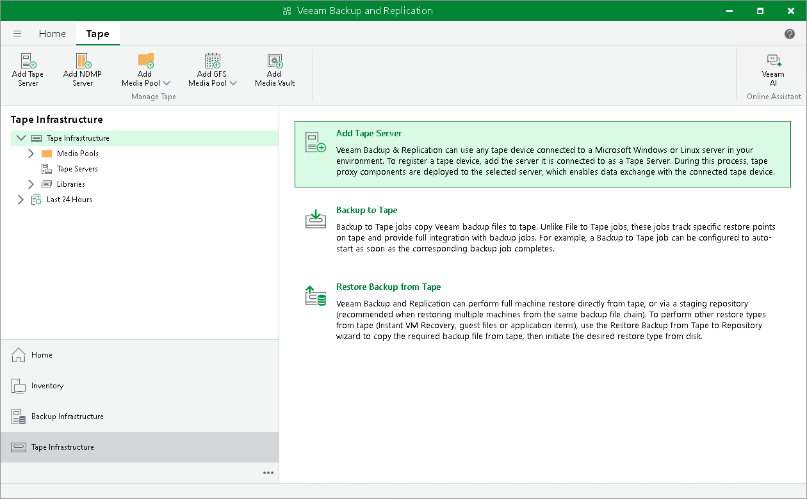

# Step 1. Launch New Tape Server Wizard

In this article

To launch the New Tape Server wizard:

1. Open the Tape Infrastructure view.
2. Do one of the following:

* In the inventory pane, right-click Tape Servers and select Add tape server.
* In the inventory pane, select Tape Servers and click Add Tape Server on the ribbon.
* In the inventory pane, select the Tape Infrastructure node and click Add Tape Server in the working area.

Page updated 7/10/2023

Page content applies to build 13.0.1.1071
