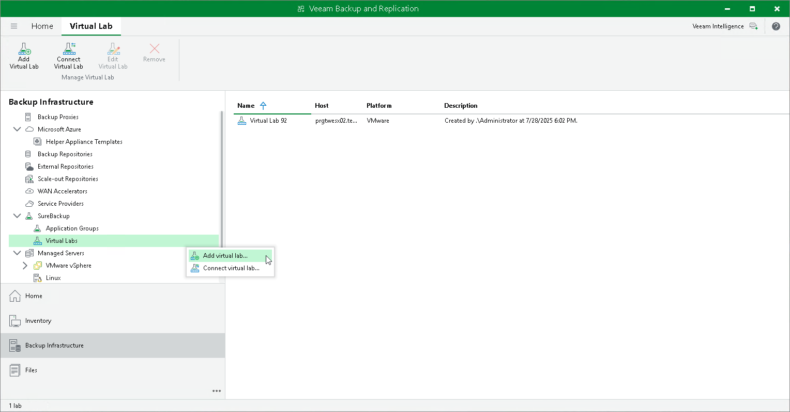

# Step 1. Launch New Virtual Lab Wizard

To launch the New Virtual Lab wizard, do one of the following:

* Open the Backup Infrastructure view, in the inventory pane select SureBackup. In the working area, click Add Virtual Lab > VMware.
* Open the Backup Infrastructure view, in the inventory pane select Virtual Labs node under SureBackup and click Add Virtual Lab > VMware vSphere.
* Open the Backup Infrastructure view, in the inventory pane right-click Virtual Labs under SureBackup and select Add Virtual Lab > VMware vSphere.

