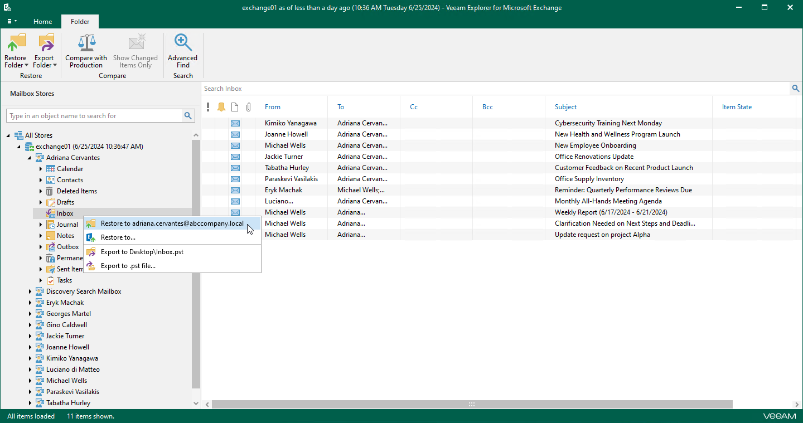

# Step 1. Launch Restore Wizard

In this article

Depending on the type of object you want to restore, to launch the Restore wizard, the following actions are available:

* If you want to restore a mailbox, do one of the following:

* In the navigation pane, select a mailbox that you want to restore, and on the Mailbox tab, click Restore Mailbox > Restore to <mailbox\_name>.
* In the navigation pane, right-click a mailbox that you want to restore and select Restore to <mailbox\_name>.

* If you want to restore a folder, do one of the following:

* In the navigation pane, select a folder that you want to restore, and on the Folder tab, click Restore Folder > Restore to <mailbox\_name>.
* In the navigation pane, right-click a folder that you want to restore and select Restore to <mailbox\_name>.

* If you want to restore an item, do one of the following:

* In the preview pane, select an item that you want to restore, and on the Items tab, click Restore Item > Restore to <mailbox\_name>.
* In the preview pane, right-click an item that you want to restore and select Restore to <mailbox\_name>.

Page updated 9/18/2024

Page content applies to build 13.0.1.1071
