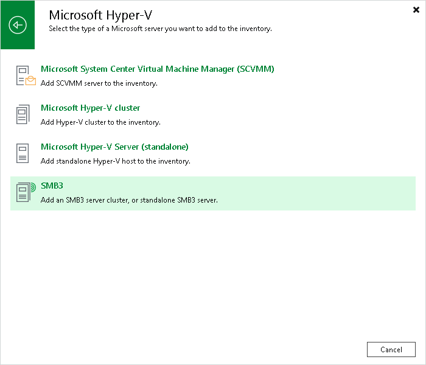

# Step 1. Launch New SMB3 Server Wizard

In this article

To launch the New SMB3 Server wizard, do the following:

1. Open the Backup Infrastructure view.
2. In the [inventory pane](vbr_ui.md), right-click the Managed Servers node and select Add Server. Alternatively, you can click Add Server on the ribbon.
3. In the Add Server window, click Virtualization Platforms > Microsoft Hyper-V > SMB3.

Page updated 8/12/2024

Page content applies to build 13.0.1.1071
