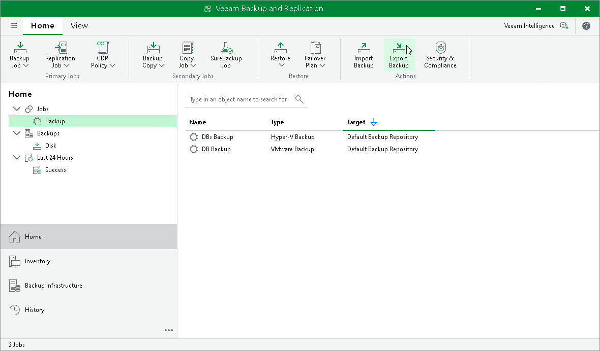

# Step 1. Launch Export Backup Wizard

To launch the Export Backup wizard, do either of the following:

* On the Home tab, click Export Backup.
* In the Home view under the Backups > Disks node, select a VM you want to transform into a full backup file and click Export backup.

