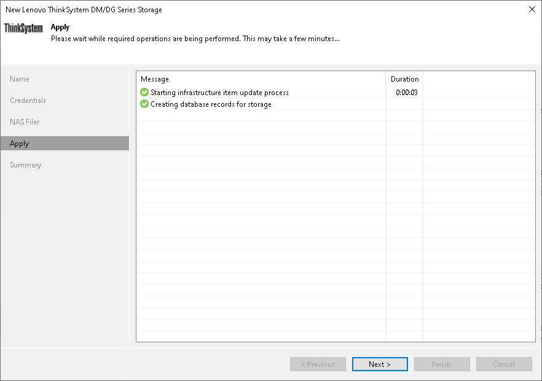

# Step 7. Apply Settings

In this article

At the Apply step of the wizard, wait until Veeam Backup & Replication adds the storage system to the backup infrastructure. After that, click Next.

Page updated 10/17/2025

Page content applies to build 13.0.1.1071
