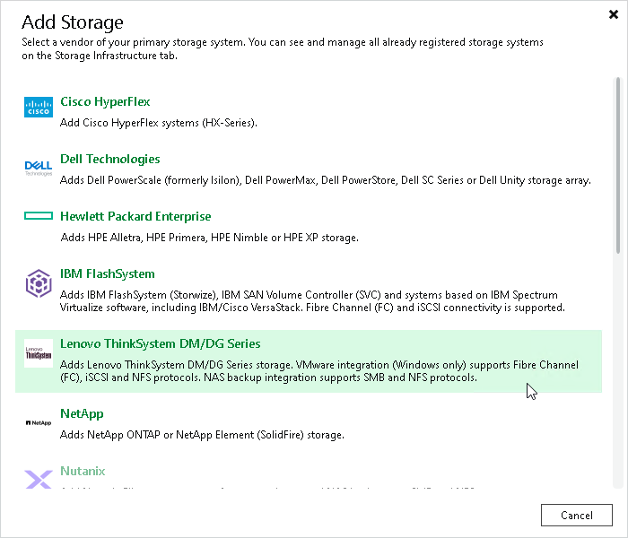

# Step 1. Launch New Lenovo ThinkSystem DM Series Storage Wizard

In this article

To launch the wizard for adding a storage system, do the following:

1. Open the Storage Infrastructure view.
2. In the working area, click Add Storage. Alternatively, you can right-click the Storage Infrastructure node and select Add Storage.
3. In the Add Storage window, select Lenovo ThinkSystem DM Series.

|  |
| --- |
| Tip |
| If you have at least one Lenovo storage system in the backup infrastructure, you can select the <Lenovo storage model name> node in the inventory pane, right-click anywhere in the working area and select Add storage. |

Page updated 5/23/2025

Page content applies to build 13.0.1.1071
