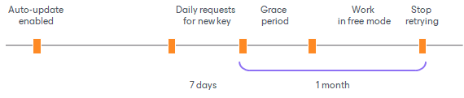
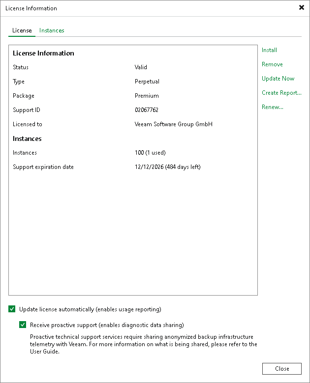

# Updating License Automatically

You can instruct Veeam Backup & Replication to automatically update the license installed on the backup server or Veeam Backup Enterprise Manager server. With automatic license update, you do not need to download and install the license manually each time when you purchase the license extension. If the automatic update option is enabled, Veeam Backup & Replication proactively communicates with the Veeam License Update Server to obtain and install a new license before the current license expires.

Requirements and Limitations for Automatic License Update

* Automatic license update is not available in the Veeam Backup & Replication Community Edition.
* Only licenses that contain a real contract number in the Support ID can be updated with the Update license key automatically option.
* If you are managing backup servers with Veeam Backup Enterprise Manager, all license management tasks must be performed in the Veeam Backup Enterprise Manager console. Automatic update settings configured in Veeam Backup Enterprise Manager override automatic update settings configured in Veeam Backup & Replication.

For example, if the automatic update option is enabled in Veeam Backup Enterprise Manager but disabled in Veeam Backup & Replication, automatic update will be performed anyway. For more information, see the [Veeam Backup Enterprise Manager User Guide](https://helpcenter.veeam.com/docs/vbr/em/em_license_update.html?ver=13#updating-license-automatically).

|  |
| --- |
| Note |
| Veeam Backup & Replication does not automatically update an existing per-VM or socket license that was obtained for an earlier version of the product to a new instance license.  To overcome this issue, after you upgrade to Veeam Backup & Replication 11, you must obtain in the [Veeam Customer Support Portal](https://my.veeam.com/#/my-products) a new instance license and install it on the backup server manually. |

How Automated License Update Works

To update installed licenses automatically, Veeam Backup & Replication performs the following actions:

1. After you enable automatic license update, Veeam Backup & Replication starts sending requests to the Veeam License Update Server on the web (autolk.veeam.com) and checks if a new license key is available. Veeam Backup & Replication sends requests once a week. Communication with the Veeam License Update Server is performed over the HTTPS protocol.
2. Seven days before the expiration date of the current license, Veeam Backup & Replication starts sending requests once a day.
3. When a new license key becomes available, Veeam Backup & Replication automatically downloads it and installs on the backup server or Veeam Backup Enterprise Manager server.

The new license key differs from the previously installed license key in the license expiration date and support expiration date. If you have obtained a license for a greater number of instances, counters in the new license also display the new number of license instances.

Automatic License Update Results

Automatic license update can complete with the following results:

* Operation is successful. A new license key is successfully generated, downloaded and installed on the backup server or Veeam Backup Enterprise Manager server.
* A new license is not required. The currently installed license key does not need to be updated.
* The Veeam License Update Server has failed to generate a new license. Such situation can occur due to some error on the Veeam License Update Server side.
* Veeam Backup & Replication has received an invalid answer. Such situation can occur due to connectivity issues between the Veeam License Update Server and Veeam Backup & Replication.
* Licensing by the contract has been terminated. In such situation, Veeam Backup & Replication automatically disables automatic license update on the backup server or Veeam Backup Enterprise Manager server.

Automatic Update Retries

If Veeam Backup & Replication fails to update the license, it displays a notification in the session report and sends an email notification to users specified in the global email settings (if global email settings are configured on the backup server). You can resolve the issue, while Veeam Backup & Replication will keep retrying to update the license.

Veeam Backup & Replication retries to update the license key in the following way:

* If Veeam Backup & Replication fails to establish a connection to the Veeam License Update Server, retry takes place every 60 min.
* If Veeam Backup & Replication establishes a connection but you are receiving the “General license key generation error has occurred” message, the retry takes place every 24 hours.

The retry period ends one month after the license expiration date or the support expiration date (whichever is earlier). The retry period is equal to the number of days in the month of license expiration. For example, if the license expires in January, the retry period will be 31 day; if the license expires in April, the retry period will be 30 days.

If the retry period is over but the new license has not been installed, the automatic update feature is automatically disabled.

For more information about error cases, see the [License Update Session Data](https://helpcenter.veeam.com/docs/vbr/em/license_update_session_data.html?ver=13) section in the Veeam Backup Enterprise Manager Guide.

Enabling Automatic License Update

By default, automatic license update is disabled. To enable automatic license update:

1. From the main menu, select License.
2. In the License Information window, select the Update license automatically (enables usage reporting) check box.

During the installation of a Subscription or Rental license, you will see a dialog box with a suggestion to enable automatic license update.

Statistics on the automatic license update process is available under the System node in the History view. You can double-click the License key auto-update job to examine session details for the scheduled or ad-hoc automatic license update.

|  |
| --- |
| Note |
| [For Rental, Subscription, Perpetual licenses] Enabling license auto update activates [Automatic License Usage Reporting](automatic_usage_logging.md). |

