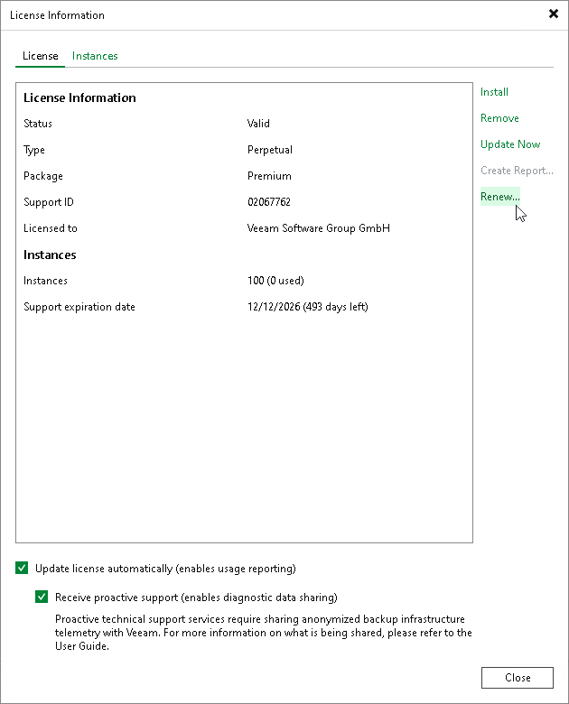

# Obtaining and Renewing License

In this article

You can obtain an Evaluation or paid license for the product when you download the product from the Veeam website.

Obtaining Paid License

To obtain a paid license, refer to the [Veeam Backup & Replication Pricing](https://www.veeam.com/products/veeam-data-platform/enterprise-packaging-pricing-options.html) page.

To obtain a Perpetual Instance license, [find a reseller](https://www.veeam.com/partners/find-a-partner.html).

Obtaining Evaluation License

To obtain an Evaluation license:

1. [Sign in to veeam.com](https://login.veeam.com/signin).
2. On the [Download Veeam products](https://www.veeam.com/downloads/) page, click the Download Trial link in the Download Product for the selected product.
3. In the License Key column, click the Request Trial Key link to download the Evaluation license.

Renewing License

To renew your maintenance plan, contact Veeam Renewals Team at renewals@veeam.com.

If you have a Perpetual or Subscription license, you can also renew your license contract online.

To renew the license:

1. From the main menu, select License.
2. In the License Information window, click Renew.

Veeam Backup & Replication will forward you to the Renewals page of Veeam website, where you can select your new maintenance plan. When your contract is renewed, you have to [update your license](license_update.md).

Note that the Renew option is subject to restrictions. If online renewal is not possible for your account, you will be redirected to the [Renewal Request](https://www.veeam.com/renewal.html) page. There you will be able to submit a request for Veeam Renewals Team.

Page updated 12/19/2025

Page content applies to build 13.0.1.1071
