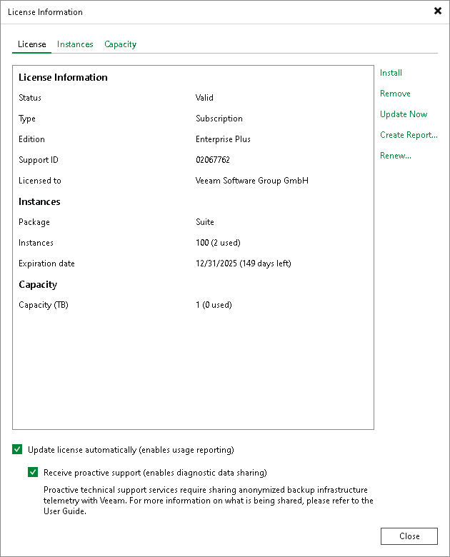

# Updating License Manually

You can update the license manually on demand. When you update the license manually, Veeam Backup & Replication connects to the Veeam License Update Server, downloads a new license from it (if the license is available) and installs it on the backup server.

|  |
| --- |
| Important |
| To update the license, the backup server in your Veeam Backup & Replication installation must have access to the Veeam License Update Server (vbr.butler.veeam.com, autolk.veeam.com) using TCP on port 443. |

The new license key differs from the previously installed license key in the license expiration date or support expiration date. If you have obtained a license for a greater number of instances, counters in the new license also display the new number of license instances.

To update the license:

1. From the main menu, select License.
2. In the License Information window, click Update Now.

Statistics on the manual license update process is available under the System node in the History view. You can double-click the License key auto-update job to examine session details for the license update operation.

Manual License Update Results

Manual license update can complete with the following results:

* Operation is successful. A new license key is successfully generated, downloaded and installed on the backup server or Veeam Backup Enterprise Manager server.
* A new license is not required. The currently installed license key does not need to be updated.
* The Veeam License Update Server has failed to generate a new license. Such situation can occur due to some error on the Veeam License Update Server side.
* Veeam Backup & Replication has received an invalid answer. Such situation can occur due to connectivity issues between the Veeam License Update Server and Veeam Backup & Replication.
* Licensing by the contract has been terminated. In such situation, Veeam Backup & Replication automatically disables automatic license update on the backup server or Veeam Backup Enterprise Manager server.

