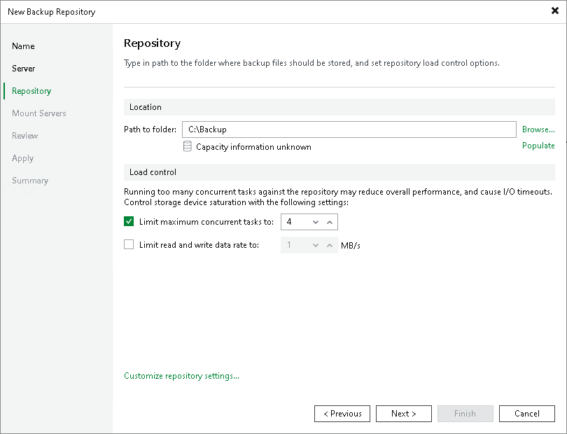

# Limitation of Concurrent Tasks

When you start a data protection or disaster recovery job, Veeam Backup & Replication analyzes the list of VMs added to the job and creates a list of tasks to be processed. Veeam Backup & Replication then defines what backup infrastructure components must be used for the job, checks what backup infrastructure components are currently available, and assigns necessary components to process the created job tasks. The task concept differs depending on the type of operation.

Backup infrastructure components typically process several tasks at the same time. You can limit the number of tasks that backup infrastructure components must process concurrently. Task limitation helps you balance the workload across the backup infrastructure and avoid performance bottlenecks.

Veeam Backup & Replication lets you limit the number of concurrent tasks for the following backup infrastructure components:

* [Backup proxies](#proxy)
* [Backup repositories](#repo)

|  |
| --- |
| Note |
| Task limits set for backup infrastructure components influence job performance. For example, you add a VM with 6 disks to a job and assign a backup proxy that can process maximum 4 tasks concurrently for the job. In this case, Veeam Backup & Replication will create 6 tasks (1 task per each VM disk) and start processing 4 tasks in parallel. The other 2 tasks will be pending. |

How Task Limitation Works

Task limiting is performed by the Veeam Backup Service. The Veeam Backup Service is aware of all backup proxies and backup repositories in the backup infrastructure, and task limitation settings configured for them.

When a job starts, it informs the Veeam Backup Service about the list of tasks created for the job and backup infrastructure resources that must be used for the job. The Veeam Backup Service detects the number of tasks that required backup infrastructure components are currently processing and analyzes the number of allowed tasks for these components. If the number of currently processed tasks has reached the allowed limit, the backup infrastructure component will not start processing a new task until one of the currently running tasks finishes.

Task Limitation for Backup Proxies

During data protection or recovery jobs, Veeam Backup & Replication creates a separate task per each disk of every VM added to the job.

We recommend that you define the maximum number of concurrent tasks depending on the number of CPU cores and RAM available on the backup proxy. To calculate the optimum limit, we recommend that you follow the rule: not more than 2 tasks per 1 CPU core and not less than 1 GB RAM for each concurrent task for a VMware backup proxy, or not less than 500 MB RAM for each concurrent task for Hyper-V off-host backup proxy, or not less than 4 GB RAM for each concurrent task for general-purpose backup proxy (in case of Veeam Agent and storage system snapshot integration, 1 GB RAM). For more information about RAM requirements for the backup proxy roles, see [System Requirements](system_requirements.md).

To limit the number of concurrent tasks on the backup proxy, you must define the Max concurrent tasks setting for the backup proxy.

Task Limitation for Backup Repositories

The number of tasks that Veeam Backup & Replication creates during data protection or recovery jobs depends on the type of the workload:

* For VMware vSphere and Microsoft Hyper-V workloads, Veeam Backup & Replication creates 1 task per every VM disk (that is, a disk of a VM added to the job).
* For oVirt KVM, Nutanix AHV, Proxmox VE and Scale Computing HyperCore workloads, Veeam Backup & Replication creates 1 task per every VM added to the job.

Synthetic operations performed in the backup repository (such as synthetic full backup, backup files merge and transformation) are also regarded as tasks. For these operations, Veeam Backup & Replication creates 1 task per every VM chain (that is, for every VM added to the job).

We recommend that you define the maximum number of concurrent tasks based on the number of CPU cores and RAM available on the backup repository. To calculate the optimum limit, follow the rule: not more than 2 tasks per 1 CPU core, not less than 1 GB RAM for each concurrently processed machine disk and not less than 4 GB RAM for each concurrently processed unstructured data source (in case of deduplicating storage appliances, up to 8 GB RAM). In the case of shared folder backup repositories, the same amount of resources is required for gateway servers.

To limit the number of concurrent tasks in a backup repository, you must enable the Limit maximum concurrent tasks to <N> option on the backup repository and define the necessary task limit.

If you use backup repositories for backup copy jobs, you must also consider tasks for read operations.

|  |
| --- |
| Note |
| When you limit the number of tasks for the backup repository, consider the storage throughput. If the storage system is not able to keep up with the number of tasks that you have assigned, it will be the limiting factor. It is recommended that you test the components and resources of the backup infrastructure to define the workload that they can handle. |

Task Limitation for Components with Several Roles

One machine can perform several roles. For example, you can assign roles of the backup proxy and backup repository to the same machine, or use the backup proxy as a gateway server for a shared folder backup repository. In such a situation, you must make sure that the backup infrastructure component can process the cumulative number of tasks specified for different roles.

We do not recommend sharing backup infrastructure components across Veeam installations. However, if you use the same infrastructure component with multiple Veeam Backup & Replication servers, ensure that this component can handle the cumulative workload for all Veeam Backup & Replication servers to which it is added. For more information on sharing backup infrastructure components across Veeam installations, see [System Requirements](system_requirements.md#recommendations).

