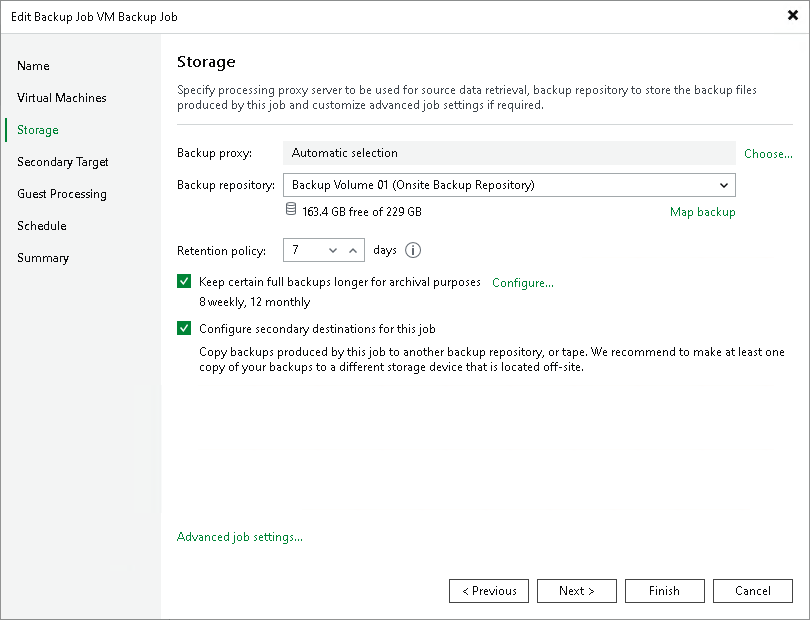
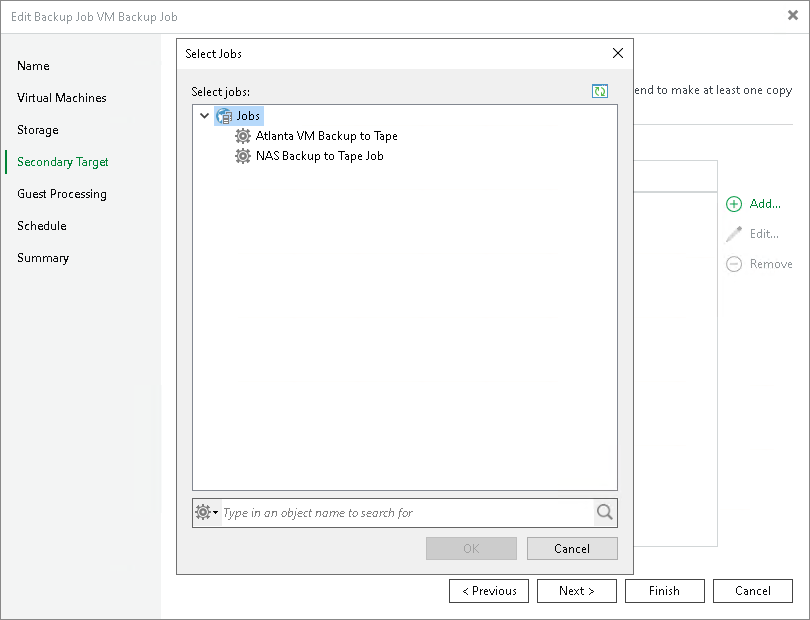

# Linking Backup Jobs to Backup to Tape Jobs

In this article

Apart from [creating a backup to tape job](creating_backup_to_tape_jobs.md) for an existing backup job, you can link a backup job to an existing backup to tape job using the [Backup Job](backup_job.md) wizard.

To point a backup job to an existing backup to tape job, perform the following steps:

1. Open the backup job settings and navigate to the Storage step. Select the Configure secondary destination for this job check box.

1. At the Secondary Target step, click Add and choose a backup to tape job to which the backup job should be linked.

1. Save settings. Veeam Backup & Replication will automatically update backup files settings of the chosen backup to tape job.

Related Topics

* [Backup to Tape](backup_to_tape_jobs.md)
* [Creating Backup to Tape Jobs](creating_backup_to_tape_jobs.md)

* [Creating Backup Jobs (VMware vSphere)](backup_job.md)

* [Creating Backup Jobs (Microsoft Hyper-V)](backup_job_hv.md)

Page updated 5/21/2025

Page content applies to build 13.0.1.1071
