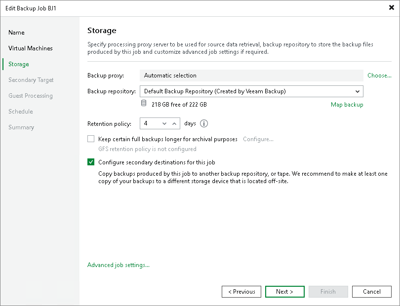
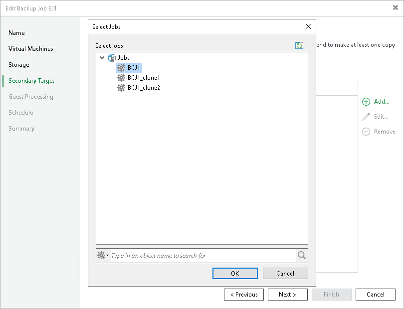

# Linking Backup Jobs to Backup Copy Jobs

In this article

You can link backup jobs to backup copy jobs. This option lets you create a secondary target for the backup job and store backups created by the backup job in the secondary backup repository.

When you link a backup job to the backup copy job, Veeam Backup & Replication automatically updates properties of the backup copy job and adds to it the backup job as a source of data. During every backup copy session, the backup copy job checks the source backup repository for new restore points. As soon as a backup job session is finished and a new restore point appears in the source backup repository, the backup copy job automatically copies this restore point to the target backup repository.

You can link a backup job to an existing backup copy job using the Backup Job wizard. To link jobs:

1. Open the backup job settings for editing. For more information, see [Editing Job Settings](editing_jobs.md).
2. Navigate to the Storage step.
3. Select the Configure secondary destination for this job check box.

1. At the Secondary Target step of the wizard, click Add and choose a backup copy job to which the backup job must be linked. The backup copy job must be already configured on the backup server.

Page updated 9/1/2025

Page content applies to build 13.0.1.1071
