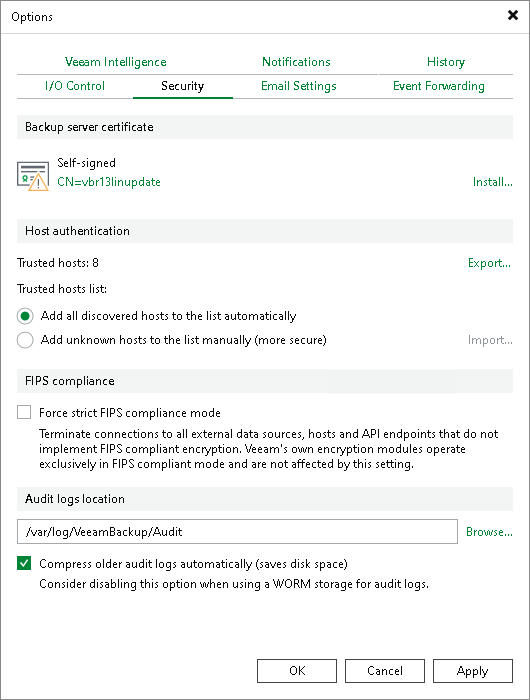

# Host Authentication

In the Host authentication section of Veeam Backup & Replication settings, you can specify verification settings for protected machines.

|  |
| --- |
| Note |
| Veeam Backup & Replication uses the SHA-256 hashing algorithm for verification. |

You can select one of the following options:

* Add all discovered hosts to the list automatically — Veeam Backup & Replication allows all servers added to the protection group and all VMs to connect to the backup server. SSH and deployer certificate fingerprints are added to the Veeam Backup & Replication database and checked every time a machine establishes a connection with the backup server. If the SSH or certificate fingerprints do not match, the connection fails.

* Add unknown hosts to the list manually — this option provides a more secure environment because only trusted servers and VMs can connect to the backup server.

