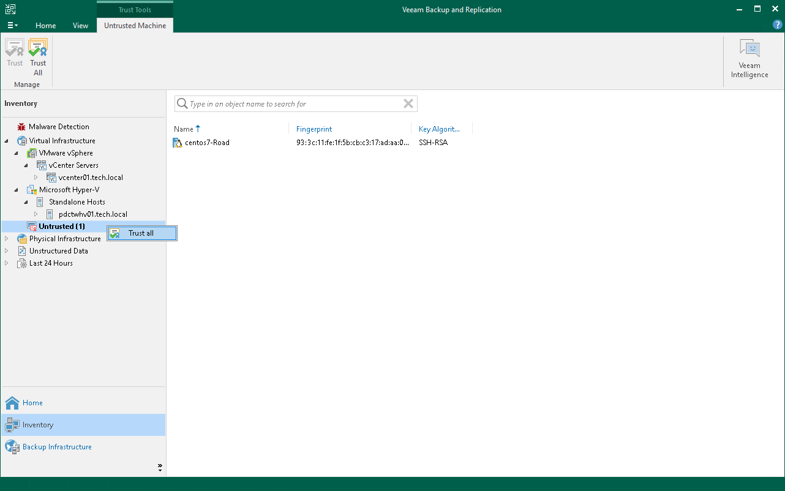
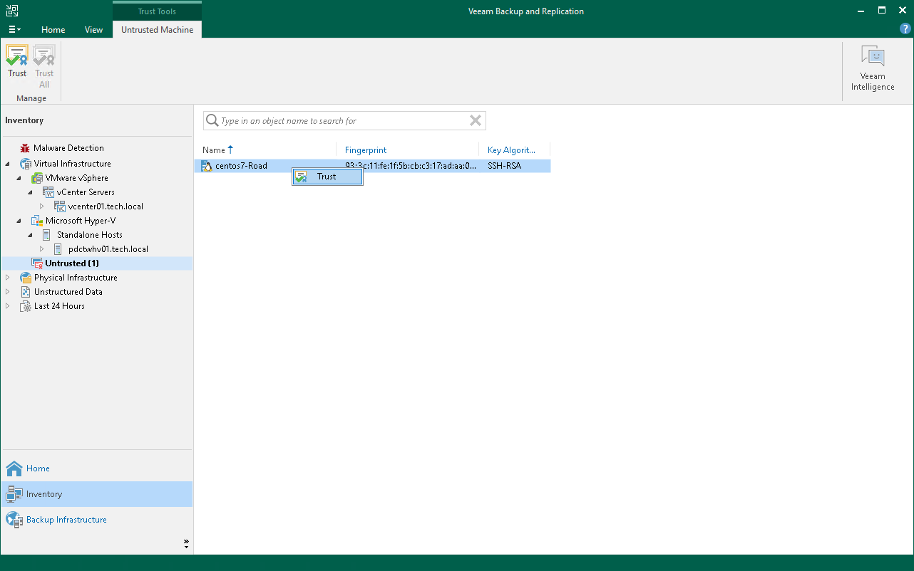
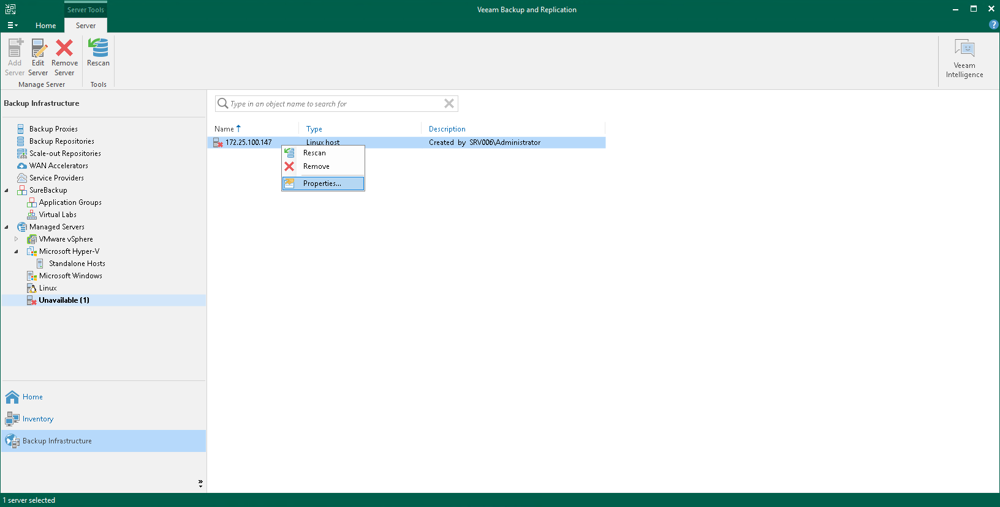

# Validating Untrusted Hosts

When you select the Add unknown hosts to the list manually option in Veeam Backup & Replication settings, you need to validate the SSH or deployer certificate fingerprints of untrusted servers and VMs manually in the Veeam Backup & Replication console.

|  |
| --- |
| Important |
| When you validate untrusted hosts, consider the following:   * To avoid fingerprint mismatch errors, you must use unique hostnames on your network. * If a VM or server unexpectedly becomes untrusted by Veeam Backup & Replication, contact Veeam Support. |

Validating VMs

During discovery, Veeam Backup & Replication places untrusted VMs in the Untrusted node in the inventory pane. You can validate all untrusted VMs at once or a specific VM:

* To validate all untrusted VMs at once, select the Untrusted node and click Trust All on the ribbon. Alternatively, you can right-click the Untrusted node and select Trust all.

* To validate a specific VM, select it in the working area and click Trust on the ribbon. Alternatively, you can right-click the VM and select Trust.

Validating Servers

If the SSH public key of a server is changed, Veeam Backup & Replication puts this machine to the Unavailable node in the Backup Infrastructure view. To validate the server, do the following:

1. Right-click the server and select Properties.
2. In the Access step of the Edit Server wizard, click Apply.
3. In the dialog box, click Yes to confirm that you trust this server.
4. Click Finish to close the wizard.

