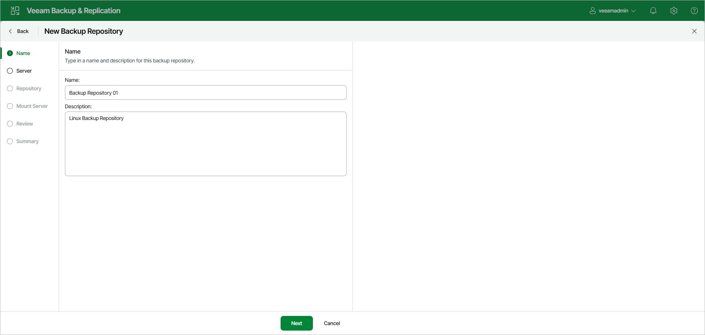

# Step 2. Specify Backup Repository Name and Description

At the Name step of the wizard, specify a name and description for the backup repository:

1. In the Name field, specify a name for the backup repository.
2. In the Description field, provide a description for future reference.

