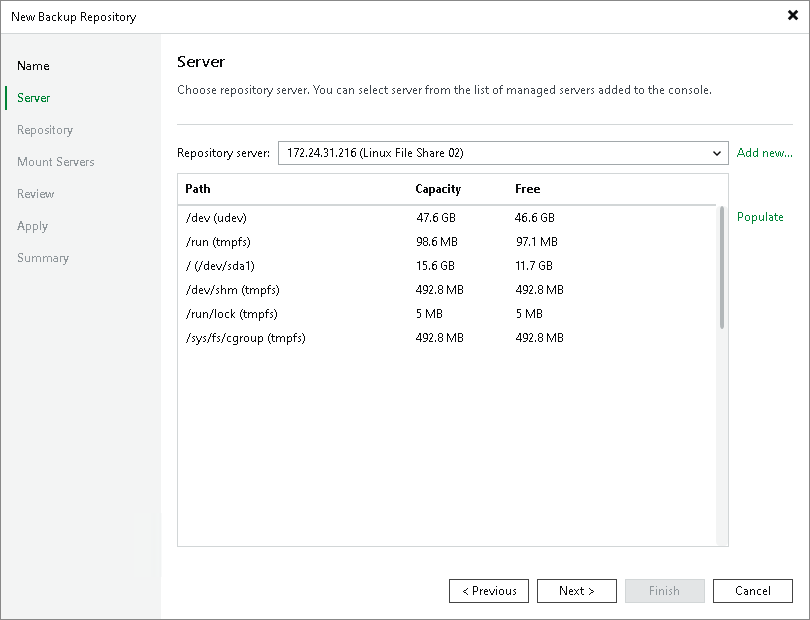

# Step 3. Specify Server Settings

In this article

To configure settings for a Linux server:

1. From the Repository server list, select the Linux server that you want to use as a backup repository.

The Repository server list contains only those servers that are added to the backup infrastructure. If the server is not added to the backup infrastructure yet, you can click Add New on the right to open the New Linux Server wizard.

|  |
| --- |
| Note |
| Note that you cannot add ExaGrid, Quantum DXi, Fujitsu ETERNUS CS800 and Infinidat InfiniGuard servers as Linux-based backup repositories. These servers are integrated with Veeam Backup & Replication, and thus must be added as [deduplicating storage appliances](deduplicating_storage_appliances.md). |

1. Click Populate to see a list of disks connected to the server, their capacity and free space.

Page updated 9/5/2025

Page content applies to build 13.0.1.1071
