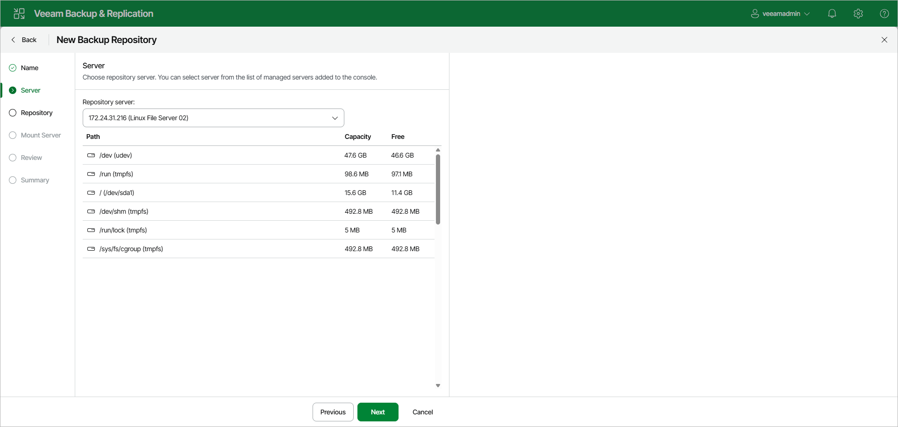

# Step 3. Specify Server Settings

At the Server step of the wizard, select a Linux server that you want to use as a backup repository from the Repository server list. The Repository server list contains only those servers that are added to the backup infrastructure.

|  |
| --- |
| Note |
| Note that you cannot add ExaGrid, Quantum DXi, Fujitsu ETERNUS CS800 and Infinidat InfiniGuard servers as Linux-based backup repositories. These servers are integrated with Veeam Backup & Replication, and thus must be added as [deduplicating storage appliances](deduplicating_storage_appliances.md). |

